# Chain of Responsibility Design Pattern

> **"Avoid coupling the sender of a request to its receiver by giving more than one object a chance to handle the request. Chain the receiving objects and pass the request along the chain until an object handles it."** — *Gang of Four (GoF)*

---

## 📖 Introduction

The **Chain of Responsibility Pattern** is a behavioral design pattern that processes requests through a chain of potential handler objects. Each handler in the chain contains reference to the next handler and decides either to process the request or pass it along to the successor.

This pattern is widely used in customer support ticket escalation systems (Level 1 -> Level 2 -> Manager), middleware processing pipelines (HTTP authentication -> rate limiting -> logging), and exception handling mechanisms.

---

## 🛑 Problem Statement vs. Solution

### ❌ Without Chain of Responsibility
The client sender is tightly coupled to specific support handlers and must contain manual routing logic:
```java
// Client manually evaluates which handler can process the issue
if (issue.equals("password")) {
    new Level1Support().resolve(issue);
} else if (issue.equals("refund")) {
    new Level2Support().resolve(issue);
} else if (issue.equals("legal")) {
    new ManagerSupport().resolve(issue);
}
```

### ✅ With Chain of Responsibility
The client submits requests to the head of a handler chain; the chain automatically forwards requests until handled:
```java
// Chain configured: level1 -> level2 -> manager
SupportHandler level1 = new Level1Support();
level1.setNext(level2);
level2.setNext(manager);

// Single entry point handles routing transparently
level1.handleRequest("password");
level1.handleRequest("refund");
```

---

## 🛠️ System Architecture & Mapping

| Component | Role | Description |
| :--- | :--- | :--- |
| **`SupportHandler`** | Abstract Handler | Defines common interface (`handleRequest`) and maintains link to `nextHandler`. |
| **`Level1Support`** | Concrete Handler 1 | Handles basic tier issues (`password`), else delegates to next handler. |
| **`Level2Support`** | Concrete Handler 2 | Handles intermediate tier issues (`refund`), else delegates to next handler. |
| **`ManagerSupport`** | Concrete Handler 3 | Handles high tier issues (`legal`), else reports issue unresolvable. |
| **`Main`** | Client Entry Point | Builds the chain hierarchy and dispatches support requests. |

---

## 🗺️ Architectural Workflow

```mermaid
graph LR
    Client[Main Client] -->|handleRequest| L1[Level1Support]
    L1 -->|password ? Solved : Pass| L2[Level2Support]
    L2 -->|refund ? Solved : Pass| Manager[ManagerSupport]
    Manager -->|legal ? Solved : Unresolvable| End[End]

    style Client fill:#bbf,stroke:#333,stroke-width:2px
    style L1 fill:#dfd,stroke:#333,stroke-width:1px
    style L2 fill:#ffd,stroke:#333,stroke-width:1px
    style Manager fill:#f9f,stroke:#333,stroke-width:1px
    style End fill:#fbb,stroke:#333,stroke-width:1px
```



---

## 🔍 Code Walkthrough

### 1. Abstract Handler (`SupportHandler`)
Defines successor link and request contract:
```java
abstract class SupportHandler {
    protected SupportHandler nextHandler;

    public void setNext(SupportHandler nextHandler) {
        this.nextHandler = nextHandler;
    }

    public abstract void handleRequest(String issue);
}
```

### 2. Concrete Handlers (`Level1Support`, `Level2Support`, `ManagerSupport`)
Implement specific handling logic and chaining:
```java
class Level1Support extends SupportHandler {
    @Override
    public void handleRequest(String issue) {
        if (issue.equalsIgnoreCase("password")) {
            System.out.println("Level 1 solved Password Issue");
        } else if (nextHandler != null) {
            nextHandler.handleRequest(issue);
        }
    }
}

class Level2Support extends SupportHandler {
    @Override
    public void handleRequest(String issue) {
        if (issue.equalsIgnoreCase("refund")) {
            System.out.println("Level 2 solved Refund Issue");
        } else if (nextHandler != null) {
            nextHandler.handleRequest(issue);
        }
    }
}

class ManagerSupport extends SupportHandler {
    @Override
    public void handleRequest(String issue) {
        if (issue.equalsIgnoreCase("legal")) {
            System.out.println("Manager solved Legal Issue");
        } else {
            System.out.println("Issue cannot be resolved.");
        }
    }
}
```

### 3. Client Application (`Main.java`)
Configures the handler chain and dispatches requests:
```java
package BehaviouralDesignPatterns.ChainOfResponsibility;

public class Main {
    public static void main(String[] args) {
        SupportHandler level1 = new Level1Support();
        SupportHandler level2 = new Level2Support();
        SupportHandler manager = new ManagerSupport();

        level1.setNext(level2);
        level2.setNext(manager);

        level1.handleRequest("password");
        System.out.println();
        level1.handleRequest("refund");
        System.out.println();
        level1.handleRequest("legal");
        System.out.println();
        level1.handleRequest("network");
    }
}
```

---

## 💡 Key Benefits

1. **Decouples Request Sender & Receiver**: Senders do not need to know which specific handler object will process the request.
2. **Single Responsibility Principle (SRP)**: Separates classes that invoke operations from classes that handle operations.
3. **Flexible Handler Configuration**: Handlers can be added, removed, or reordered dynamically at runtime.
