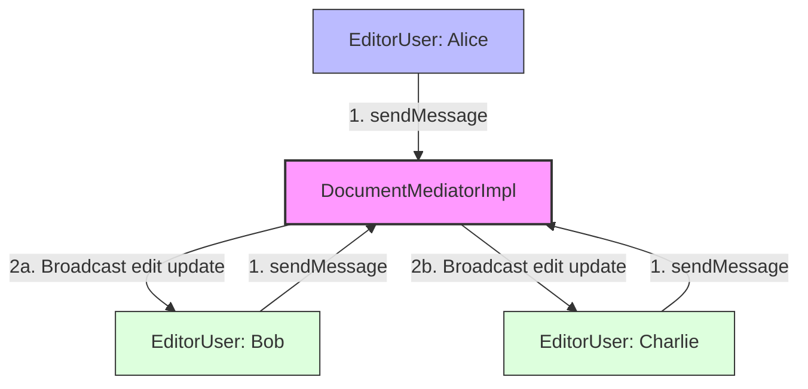

# Mediator Design Pattern

> **"Define an object that encapsulates how a set of objects interact. Mediator promotes loose coupling by keeping objects from referring to each other explicitly, and it lets you vary their interaction independently."** — *Gang of Four (GoF)*

---

## 📖 Introduction

The **Mediator Pattern** is a behavioral design pattern that reduces chaotic dependencies between objects by forcing them to communicate solely through a central mediator object. Instead of objects referring to and calling each other directly (creating a complex $N \times N$ web of dependencies), objects only communicate with the mediator ($N \to 1$).

This pattern is widely used in chat rooms, air traffic control towers, collaborative document editing systems, and complex GUI forms.

---

## 🛑 Problem Statement vs. Solution

### ❌ Without Mediator Pattern
Users/components maintain direct references to every other user/component ($N \times N$ connections):
```java
// Tightly coupled N x N communication references
alice.setBob(bob);
alice.setCharlie(charlie);
alice.sendToBob("Hello Bob");
alice.sendToCharlie("Hello Charlie");
```

### ✅ With Mediator Pattern
Components interact strictly through a central `DocumentMediator` ($N \to 1$ connections):
```java
// Decoupled communication via central Mediator hub
DocumentMediator mediator = new DocumentMediatorImpl();
mediator.addUser(alice);
mediator.addUser(bob);
mediator.addUser(charlie);

// Alice sends message to mediator, which broadcasts to other users
alice.sendMessage("Added Introduction");
```

---

## 🛠️ System Architecture & Mapping

| Component | Role | Description |
| :--- | :--- | :--- |
| **`DocumentMediator`** | Mediator Interface | Contract for routing messages (`sendMessage`) and registering participants (`addUser`). |
| **`DocumentMediatorImpl`** | Concrete Mediator | Manages list of users and broadcasts edit notifications to all except sender. |
| **`User`** | Abstract Colleague | Holds reference to `DocumentMediator` and defines messaging methods. |
| **`EditorUser`** | Concrete Colleague | Implements message reception logic for document editor users. |
| **`Main`** | Client Entry Point | Configures mediator, registers users, and triggers collaborative messages. |

---

## 🗺️ Architectural Workflow



---

## 🔍 Code Walkthrough

### 1. Mediator Interface (`DocumentMediator`)
Declares communication hub methods:
```java
interface DocumentMediator {
    void sendMessage(String message, User sender);
    void addUser(User user);
}
```

### 2. Abstract Colleague (`User`)
Maintains mediator reference:
```java
abstract class User {
    protected String name;
    protected DocumentMediator mediator;

    public User(String name, DocumentMediator mediator) {
        this.name = name;
        this.mediator = mediator;
    }

    public void sendMessage(String message) {
        mediator.sendMessage(message, this);
    }

    public abstract void receiveMessage(String message);
}
```

### 3. Concrete Colleague (`EditorUser`)
Implements message reception:
```java
class EditorUser extends User {
    public EditorUser(String name, DocumentMediator mediator) {
        super(name, mediator);
    }

    @Override
    public void receiveMessage(String message) {
        System.out.println(name + " received: " + message);
    }
}
```

### 4. Concrete Mediator (`DocumentMediatorImpl`)
Coordinates message routing between registered colleagues:
```java
class DocumentMediatorImpl implements DocumentMediator {
    private List<User> users = new ArrayList<>();

    @Override
    public void addUser(User user) {
        users.add(user);
    }

    @Override
    public void sendMessage(String message, User sender) {
        for (User user : users) {
            if (user != sender) {
                user.receiveMessage(sender.name + " edited document: " + message);
            }
        }
    }
}
```

### 5. Client Application (`Main.java`)
Configures mediator and executes collaborative document edits:
```java
package BehaviouralDesignPatterns.MediatorPattern;

public class Main {
    public static void main(String[] args) {
        DocumentMediator mediator = new DocumentMediatorImpl();

        User alice = new EditorUser("Alice", mediator);
        User bob = new EditorUser("Bob", mediator);
        User charlie = new EditorUser("Charlie", mediator);

        mediator.addUser(alice);
        mediator.addUser(bob);
        mediator.addUser(charlie);

        alice.sendMessage("Added Introduction");
        System.out.println();
        bob.sendMessage("Corrected Grammar");
    }
}
```

---

## 💡 Key Benefits

1. **Decouples Colleagues**: Colleagues do not depend on each other directly; they only depend on the mediator interface.
2. **Centralized Control**: Encapsulates interaction policies in one place, making communication rules easier to update and maintain.
3. **Simplifies Object Protocols**: Replaces many-to-many relationships ($N \times N$) with one-to-many relationships ($N \to 1$).
