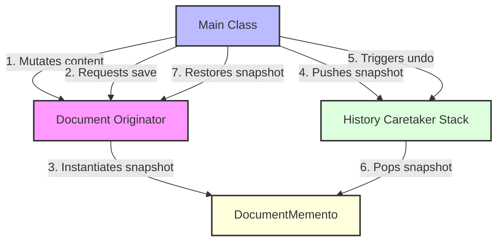

# Memento Design Pattern

> **"Without violating encapsulation, capture and externalize an object's internal state so that the object can be restored to this state later."** — *Gang of Four (GoF)*

---

## 📖 Introduction

The **Memento Pattern** is a behavioral design pattern that allows saving and restoring the previous state of an object without exposing its internal structural implementation details.

It achieves state restoration while respecting object encapsulation by using three distinct roles: the **Originator** (object whose state needs to be saved), the **Memento** (immutable state snapshot), and the **Caretaker** (manages snapshot history stack for undo operations).

This pattern is widely used in text editor undo/redo features, database transaction rollbacks, and game checkpoint save systems.

---

## 🛑 Problem Statement vs. Solution

### ❌ Without Memento Pattern
To save state, external classes must access private fields directly, violating encapsulation and exposing internal object representation:
```java
// Caretaker directly inspects and modifies private state fields of Document
String savedContent = document.content; // Breaks encapsulation
document.content = savedContent;
```

### ✅ With Memento Pattern
Originator generates an immutable `DocumentMemento` snapshot. Caretaker stores state snapshots without inspecting internal details:
```java
// Originator saves state to immutable Memento snapshot
history.save(document.save());

// Caretaker pops Memento and Originator restores state cleanly
document.restore(history.undo());
```

---

## 🛠️ System Architecture & Mapping

| Component | Role | Description |
| :--- | :--- | :--- |
| **`DocumentMemento`** | Memento | Stores immutable snapshot of `Document` content state. |
| **`Document`** | Originator | Creates `DocumentMemento` snapshots (`save()`) and restores state from them (`restore()`). |
| **`History`** | Caretaker | Manages stack of `DocumentMemento` snapshots for executing `undo()` operations. |
| **`Main`** | Client Entry Point | Modifies document state, pushes checkpoints to history, and performs undo state restoration. |

---

## 🗺️ Architectural Workflow



---

## 🔍 Code Walkthrough

### 1. Memento (`DocumentMemento`)
Holds immutable state snapshot:
```java
class DocumentMemento {
    private final String content;

    public DocumentMemento(String content) {
        this.content = content;
    }

    public String getSavedContent() {
        return content;
    }
}
```

### 2. Originator (`Document`)
Creates and restores state snapshots:
```java
class Document {
    private String content;

    public void setContent(String content) {
        this.content = content;
    }

    public String getContent() {
        return content;
    }

    public DocumentMemento save() {
        return new DocumentMemento(content);
    }

    public void restore(DocumentMemento memento) {
        content = memento.getSavedContent();
    }
}
```

### 3. Caretaker (`History`)
Manages state snapshot stack for undo functionality:
```java
class History {
    private Stack<DocumentMemento> history = new Stack<>();

    public void save(DocumentMemento memento) {
        history.push(memento);
    }

    public DocumentMemento undo() {
        return history.pop();
    }
}
```

### 4. Client Application (`Main.java`)
Executes content updates and undo state restoration:
```java
package BehaviouralDesignPatterns.MementoPattern;

public class Main {
    public static void main(String[] args) {
        Document document = new Document();
        History history = new History();

        document.setContent("Hello");
        history.save(document.save());

        document.setContent("Hello World");
        history.save(document.save());

        document.setContent("Oops! Everything Deleted");
        System.out.println(document.getContent());

        document.restore(history.undo());
        System.out.println(document.getContent());

        document.restore(history.undo());
        System.out.println(document.getContent());
    }
}
```

---

## 💡 Key Benefits

1. **Preserves Encapsulation**: Restores state without exposing private fields or internal data structures of the originator.
2. **Simplifies Originator Code**: Offloads state history storage management to the caretaker class.
3. **Robust Undo/Redo Capability**: Allows building multi-level undo/redo mechanics by maintaining a history stack of mementos.
