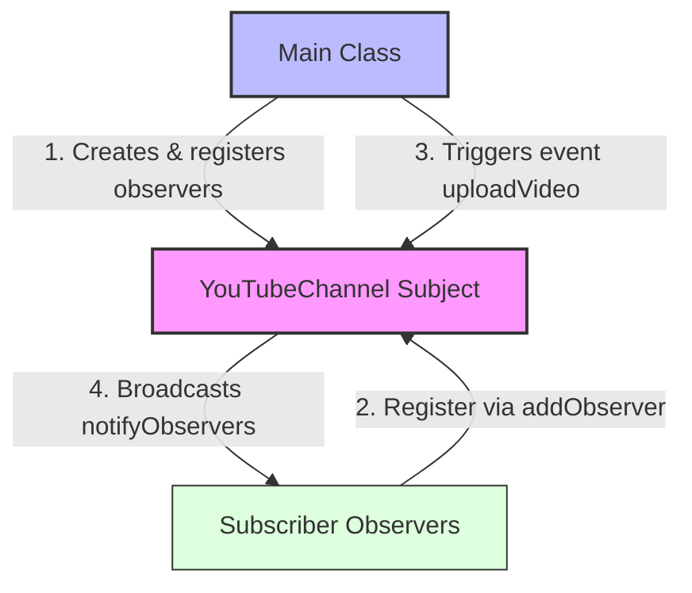

# Observer Design Pattern

> **"Define a one-to-many dependency between objects so that when one object changes state, all its dependents are notified and updated automatically."** — *Gang of Four (GoF)*

---

## 📖 Introduction

The **Observer Pattern** is a behavioral design pattern that establishes a publisher-subscriber model between objects. When a core object (known as the **Subject** or **Publisher**) undergoes a state change or executes an event, it automatically broadcasts notifications to all registered observers (known as **Subscribers** or **Listeners**).

This pattern is widely used in event-driven systems, UI frameworks, message brokers, and notification engines (such as YouTube channel uploads, stock market alerts, and pub-sub systems).

---

## 🛑 Problem Statement vs. Solution

### ❌ Without Observer Pattern
Subscribers must continuously poll the subject object to check if new content or state updates are available:
```java
// Inefficient polling loop continuously checking for updates
while (!channel.hasNewVideo()) {
    Thread.sleep(1000); // Wastes CPU cycles and creates tight coupling
}
```

### ✅ With Observer Pattern
Subject maintains a dynamic list of subscribers and pushes updates reactively whenever state changes:
```java
// Observers register interest and receive push notifications automatically
channel.addObserver(alice);
channel.addObserver(bob);

// Event notification automatically triggers update() on all registered observers
channel.uploadVideo("Observer Pattern Explained");
```

---

## 🛠️ System Architecture & Mapping

| Component | Role | Description |
| :--- | :--- | :--- |
| **`Subject`** | Subject Interface | Defines contract for managing observers (`addObserver`, `removeObserver`, `notifyObservers`). |
| **`YouTubeChannel`** | Concrete Subject | Manages list of subscribers and notifies them when `uploadVideo()` is invoked. |
| **`Observer`** | Observer Interface | Defines contract for receiving notifications (`update(String video)`). |
| **`Subscriber`** | Concrete Observer | Implements `Observer` to react when a new video notification is received. |
| **`Main`** | Client Entry Point | Instantiates channel and subscribers, registers observers, and triggers events. |

---

## 🗺️ Architectural Workflow



---

## 🔍 Code Walkthrough

### 1. Subject Interface (`Subject.java`)
Declares subscriber management methods:
```java
package BehaviouralDesignPatterns.ObserverPattern;

public interface Subject {
    void addObserver(Observer observer);
    void removeObserver(Observer observer);
    void notifyObservers();
}
```

### 2. Observer Interface (`Observer.java`)
Declares notification update handler:
```java
package BehaviouralDesignPatterns.ObserverPattern;

public interface Observer {
    void update(String video);
}
```

### 3. Concrete Subject (`YouTubeChannel.java`)
Manages subscriber state and broadcasts updates:
```java
package BehaviouralDesignPatterns.ObserverPattern;

import java.util.ArrayList;
import java.util.List;

public class YouTubeChannel implements Subject {
    private List<Observer> observers = new ArrayList<>();
    private String latestVideo;

    @Override
    public void addObserver(Observer observer) {
        observers.add(observer);
    }

    @Override
    public void removeObserver(Observer observer) {
        observers.remove(observer);
    }

    @Override
    public void notifyObservers() {
        for (Observer observer : observers) {
            observer.update(latestVideo);
        }
    }

    public void uploadVideo(String video) {
        this.latestVideo = video;
        System.out.println("\nNew Video Uploaded : " + video);
        notifyObservers();
    }
}
```

### 4. Concrete Observer (`Subscriber.java`)
Receives and handles video update notifications:
```java
package BehaviouralDesignPatterns.ObserverPattern;

public class Subscriber implements Observer {
    private String name;

    public Subscriber(String name) {
        this.name = name;
    }

    @Override
    public void update(String video) {
        System.out.println(name + " received notification: " + video);
    }
}
```

### 5. Client Application (`Main.java`)
Configures observers and publishes events:
```java
package BehaviouralDesignPatterns.ObserverPattern;

public class Main {
    public static void main(String[] args) {
        YouTubeChannel channel = new YouTubeChannel();

        Subscriber alice = new Subscriber("Alice");
        Subscriber bob = new Subscriber("Bob");
        Subscriber charlie = new Subscriber("Charlie");

        channel.addObserver(alice);
        channel.addObserver(bob);
        channel.addObserver(charlie);

        channel.uploadVideo("Observer Pattern Explained");
    }
}
```

---

## 💡 Key Benefits

1. **Loose Coupling**: Subject only knows observers implement `Observer` interface; concrete subscriber details are completely decoupled.
2. **Open/Closed Principle (OCP)**: New subscriber types can be introduced without modifying the subject class.
3. **Dynamic Relationships**: Observers can be added or removed dynamically at runtime.
