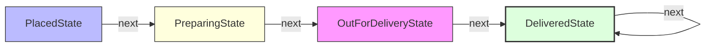

# State Design Pattern

> **"Allow an object to alter its behavior when its internal state changes. The object will appear to change its class."** — *Gang of Four (GoF)*

---

## 📖 Introduction

The **State Pattern** is a behavioral design pattern that allows an object to encapsulate state-specific behaviors into individual state classes. When an object's internal state changes, its context delegates requests to the active state object, making it behave as if its class had changed.

This pattern is widely used in finite state machines (FSMs), order fulfillment lifecycles (Placed -> Preparing -> Out for Delivery -> Delivered), media players, and connection handlers.

---

## 🛑 Problem Statement vs. Solution

### ❌ Without State Pattern
State transitions and state-dependent logic are hardcoded into massive, error-prone `switch` or `if-else` blocks inside the context:
```java
// Massive conditional blocks inside Order class
public void nextState() {
    if (state.equals("PLACED")) {
        System.out.println("Food is being prepared");
        state = "PREPARING";
    } else if (state.equals("PREPARING")) {
        System.out.println("Delivery partner assigned");
        state = "OUT_FOR_DELIVERY";
    }
}
```

### ✅ With State Pattern
Each state is encapsulated into its own `OrderState` class. State transitions occur polymorphically by reassigning state objects:
```java
// Order delegates transition logic to current OrderState instance
Order order = new Order();
order.nextState(); // Transitions PlacedState -> PreparingState
order.nextState(); // Transitions PreparingState -> OutForDeliveryState
```

---

## 🛠️ System Architecture & Mapping

| Component | Role | Description |
| :--- | :--- | :--- |
| **`OrderState`** | State Interface | Defines common contract for handling state transitions (`next(Order order)`). |
| **`PlacedState`** | Concrete State 1 | Handles transitions from Placed to Preparing. |
| **`PreparingState`** | Concrete State 2 | Handles transitions from Preparing to Out for Delivery. |
| **`OutForDeliveryState`** | Concrete State 3 | Handles transitions from Out for Delivery to Delivered. |
| **`DeliveredState`** | Concrete State 4 | Handles final state where order is already delivered. |
| **`Order`** | Context | Holds reference to current `OrderState` and delegates `nextState()` calls. |
| **`Main`** | Client Entry Point | Instantiates `Order` and triggers sequential state transitions. |

---

## 🗺️ Architectural Workflow



---

## 🔍 Code Walkthrough

### 1. Context (`Order`)
Maintains current state reference and delegates transitions:
```java
class Order {
    private OrderState state;

    public Order() {
        state = new PlacedState();
    }

    public void setState(OrderState state) {
        this.state = state;
    }

    public void nextState() {
        state.next(this);
    }
}
```

### 2. State Interface (`OrderState`)
Declares state behavior contract:
```java
interface OrderState {
    void next(Order order);
}
```

### 3. Concrete States
Implement state-specific transition logic:
```java
class PlacedState implements OrderState {
    @Override
    public void next(Order order) {
        System.out.println("Food is being prepared");
        order.setState(new PreparingState());
    }
}

class PreparingState implements OrderState {
    @Override
    public void next(Order order) {
        System.out.println("Delivery partner assigned");
        order.setState(new OutForDeliveryState());
    }
}

class OutForDeliveryState implements OrderState {
    @Override
    public void next(Order order) {
        System.out.println("Order Delivered");
        order.setState(new DeliveredState());
    }
}

class DeliveredState implements OrderState {
    @Override
    public void next(Order order) {
        System.out.println("Order already delivered");
    }
}
```

### 4. Client Application (`Main.java`)
Executes state transitions sequentially:
```java
package BehaviouralDesignPatterns.StatePattern;

public class Main {
    public static void main(String[] args) {
        Order order = new Order();

        order.nextState();
        order.nextState();
        order.nextState();
        order.nextState();
        order.nextState();
    }
}
```

---

## 💡 Key Benefits

1. **Single Responsibility Principle (SRP)**: Organizes code related to particular states into separate classes.
2. **Open/Closed Principle (OCP)**: Introduces new states without changing existing state classes or context logic.
3. **Clean Control Flow**: Eliminates cumbersome conditional logic and makes state transition sequences explicit and maintainable.
