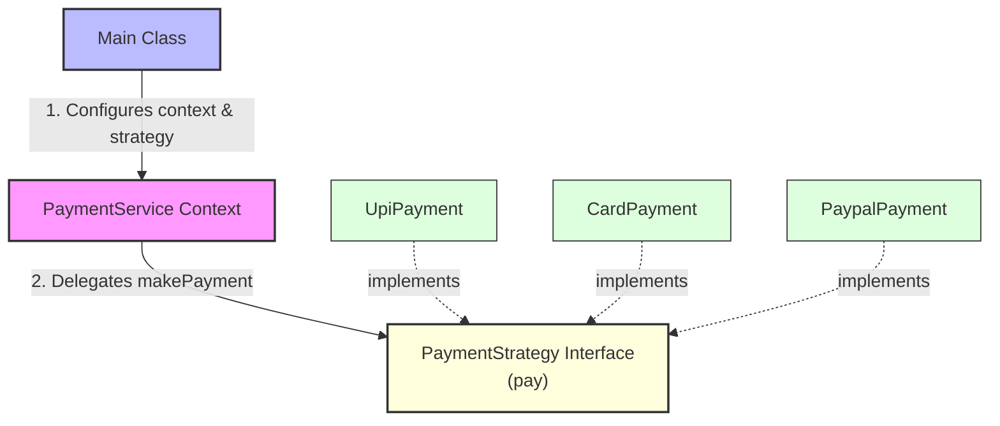

# Strategy Design Pattern

> **"Define a family of algorithms, encapsulate each one, and make them interchangeable. Strategy lets the algorithm vary independently from clients that use it."** — *Gang of Four (GoF)*

---

## 📖 Introduction

The **Strategy Pattern** is a behavioral design pattern that allows selecting an algorithm's behavior at runtime. Rather than implementing multiple algorithms directly within a single class using conditional statements (`if-else` or `switch`), each algorithm is encapsulated into its own strategy class implementing a common interface.

This pattern is widely used in payment processing engines (UPI, Credit Card, PayPal), sorting/filtering algorithms, and compression routines.

---

## 🛑 Problem Statement vs. Solution

### ❌ Without Strategy Pattern
Client logic uses conditional blocks, tightly coupling algorithms and violating open/closed principles:
```java
// Conditional payment processing logic
if (type.equals("UPI")) {
    System.out.println("Paid $" + amount + " using UPI");
} else if (type.equals("CARD")) {
    System.out.println("Paid $" + amount + " using Credit Card");
} else if (type.equals("PAYPAL")) {
    System.out.println("Paid $" + amount + " using PayPal");
}
```

### ✅ With Strategy Pattern
Algorithms are encapsulated into strategy implementations; context switches strategies cleanly at runtime:
```java
// Strategy selected and injected dynamically into PaymentService
PaymentService payment = new PaymentService(new UpiPayment());
payment.makePayment(500);

payment.setStrategy(new CardPayment());
payment.makePayment(1000);
```

---

## 🛠️ System Architecture & Mapping

| Component | Role | Description |
| :--- | :--- | :--- |
| **`PaymentStrategy`** | Strategy Interface | Common contract for all payment algorithms (`pay(double amount)`). |
| **`UpiPayment`** | Concrete Strategy 1 | Implements payment execution via UPI. |
| **`CardPayment`** | Concrete Strategy 2 | Implements payment execution via Credit Card. |
| **`PaypalPayment`** | Concrete Strategy 3 | Implements payment execution via PayPal. |
| **`PaymentService`** | Context | Maintains reference to `PaymentStrategy` and delegates execution to it. |
| **`Main`** | Client Entry Point | Configures and dynamically switches payment strategies at runtime. |

---

## 🗺️ Architectural Workflow



---

## 🔍 Code Walkthrough

### 1. Strategy Interface (`PaymentStrategy.java`)
Defines the standard algorithm signature:
```java
package BehaviouralDesignPatterns.StrategyPattern;

public interface PaymentStrategy {
    void pay(double amount);
}
```

### 2. Concrete Strategies
Encapsulate specific payment execution logic:
- **`UpiPayment.java`**:
  ```java
  public class UpiPayment implements PaymentStrategy {
      @Override
      public void pay(double amount) {
          System.out.println("Paid $" + amount + " using UPI");
      }
  }
  ```
- **`CardPayment.java`**:
  ```java
  public class CardPayment implements PaymentStrategy {
      @Override
      public void pay(double amount) {
          System.out.println("Paid $" + amount + " using Credit Card");
      }
  }
  ```
- **`PaypalPayment.java`**:
  ```java
  public class PaypalPayment implements PaymentStrategy {
      @Override
      public void pay(double amount) {
          System.out.println("Paid $" + amount + " using PayPal");
      }
  }
  ```

### 3. Context (`PaymentService.java`)
Maintains strategy reference and executes payments:
```java
package BehaviouralDesignPatterns.StrategyPattern;

public class PaymentService {
    private PaymentStrategy strategy;

    public PaymentService(PaymentStrategy strategy) {
        this.strategy = strategy;
    }

    public void setStrategy(PaymentStrategy strategy) {
        this.strategy = strategy;
    }

    public void makePayment(double amount) {
        strategy.pay(amount);
    }
}
```

### 4. Client Application (`Main.java`)
Demonstrates runtime strategy switching:
```java
package BehaviouralDesignPatterns.StrategyPattern;

public class Main {
    public static void main(String[] args) {
        PaymentService payment = new PaymentService(new UpiPayment());
        payment.makePayment(500);

        payment.setStrategy(new CardPayment());
        payment.makePayment(1000);

        payment.setStrategy(new PaypalPayment());
        payment.makePayment(2000);
    }
}
```

---

## 💡 Key Benefits

1. **Eliminates Conditional Statements**: Replaces complex `if-else` or `switch` statements with polymorphic strategy calls.
2. **Open/Closed Principle (OCP)**: New payment strategies (e.g. `CryptoPayment`) can be added without modifying `PaymentService` or existing strategy classes.
3. **Runtime Strategy Switching**: Allows client applications to change algorithms dynamically based on user selection or runtime context.
