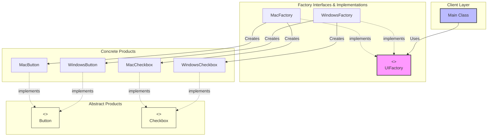

# Abstract Factory Pattern

> **"Provide an interface for creating families of related or dependent objects without specifying their concrete classes."** — *Gang of Four (GoF)*

---

## 📖 Introduction

The **Abstract Factory Pattern** is a creational design pattern that allows you to produce families of related objects without specifying their concrete classes. It acts as a **factory of factories**.

When an application needs to support multiple product variants (such as Mac UI controls vs. Windows UI controls), using concrete classes directly ties client code to specific OS platforms. The Abstract Factory pattern solves this by providing abstract interfaces for component creation, guaranteeing that created products are always compatible with one another.

---

## 🛑 Problem Statement vs. Solution

### ❌ Without Abstract Factory
Client code directly instantiates concrete UI components using `new WindowsButton()` or `new MacButton()`. If the OS changes or a new platform is added, client code must be modified in multiple places, risking mismatched controls (e.g., pairing a Windows Button with a Mac Checkbox).

###  With Abstract Factory
Client code relies strictly on abstract interfaces (`UIFactory`, `Button`, `Checkbox`). The specific concrete factory (`WindowsFactory` or `MacFactory`) is injected at runtime, ensuring that all created UI components belong to the same product family.

---

## 🛠️ System Architecture & Mapping

Here is how the components in this implementation map to the Abstract Factory pattern roles:

| Component | Role | Description |
| :--- | :--- | :--- |
| **`UIFactory`** | Abstract Factory | Declares factory methods for creating abstract products (`createButton()`, `createCheckbox()`). |
| **`WindowsFactory`** | Concrete Factory 1 | Instantiates Windows family objects (`WindowsButton`, `WindowsCheckbox`). |
| **`MacFactory`** | Concrete Factory 2 | Instantiates Mac family objects (`MacButton`, `MacCheckbox`). |
| **`Button`** | Abstract Product A | Interface declaring operations for Button components (`paint()`). |
| **`Checkbox`** | Abstract Product B | Interface declaring operations for Checkbox components (`paint()`). |
| **`WindowsButton` / `MacButton`** | Concrete Products A | OS-specific button implementations. |
| **`WindowsCheckbox` / `MacCheckbox`** | Concrete Products B | OS-specific checkbox implementations. |
| **`Main`** | Client | Uses `UIFactory` to instantiate components without referencing concrete classes. |

---

## 🗺️ Architectural Workflow



> **Note**: For a detailed UML class diagram image, view [ClassDiagram.png](./ClassDiagram.png).

---

## 🔍 Code Walkthrough

### 1. Abstract Products (`Button.java` & `Checkbox.java`)
Interfaces defining common UI behaviors:
```java
public interface Button {
    void paint();   
}

public interface Checkbox {
    void paint();
}
```

### 2. Abstract Factory (`UIFactory.java`)
Declares creation methods for all product types in the family:
```java
public interface UIFactory {
    Button createButton();
    Checkbox createCheckbox();
}
```

### 3. Concrete Factories (`WindowsFactory.java` & `MacFactory.java`)
Produces platform-matching components:
```java
public class WindowsFactory implements UIFactory {
    @Override
    public Button createButton() { return new WindowsButton(); }

    @Override
    public Checkbox createCheckbox() { return new WindowsCheckbox(); }
}
```

### 4. Client Usage (`Main.java`)
The client depends solely on `UIFactory` and abstract product interfaces:
```java
public class Main {
    public static void main(String[] args) {
        UIFactory factory = new WindowsFactory();
        Button button = factory.createButton();
        Checkbox checkbox = factory.createCheckbox();

        button.paint();   // Output: Windows Button Painted
        checkbox.paint(); // Output: Windows Checkbox Painted
    }
}
```

---

## 💡 Key Benefits

1. **Guaranteed Consistency**: Ensures products from the same factory (e.g., `MacButton` and `MacCheckbox`) are used together.
2. **Single Responsibility Principle**: Product creation code is isolated in factories.
3. **Open/Closed Principle**: New product families (e.g., `LinuxFactory`) can be added without breaking existing client code.
