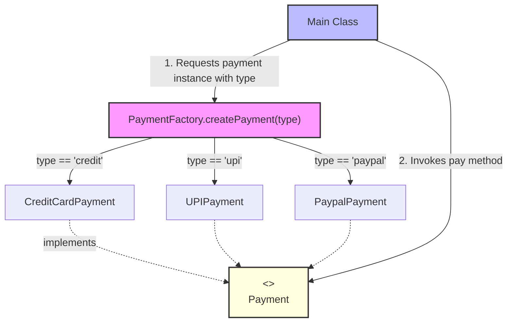

# Factory Design Pattern

> **"Define an interface for creating an object, but let subclasses or factory logic decide which class to instantiate."** — *Gang of Four (GoF)*

---

## 📖 Introduction

The **Factory Pattern** (often implemented as Simple Factory or Factory Method) encapsulates object instantiation logic into a central factory component. 

Instead of client code directly instantiating concrete classes using the `new` keyword, the client requests an object by passing an identifier or condition to the factory. This decouples client business logic from specific implementation classes.

---

## 🛑 Problem Statement vs. Solution

### ❌ Without Factory Pattern
Client code contains repetitive conditional instantiation logic:
```java
Payment payment;
if (type.equals("credit")) {
    payment = new CreditCardPayment();
} else if (type.equals("upi")) {
    payment = new UPIPayment();
} // ... scattered across multiple application controllers
```

###  With Factory Pattern
Client code calls a centralized factory method:
```java
Payment payment = PaymentFactory.createPayment("credit");
payment.pay(4000);
```

---

## 🛠️ System Architecture & Mapping

| Component | Role | Description |
| :--- | :--- | :--- |
| **`Payment`** | Abstract Product | Common interface declaring the contract for all payment operations (`pay(double amount)`). |
| **`CreditCardPayment`** | Concrete Product 1 | Handles credit card transactions. |
| **`UPIPayment`** | Concrete Product 2 | Handles UPI transactions. |
| **`PaypalPayment`** | Concrete Product 3 | Handles PayPal transactions. |
| **`PaymentFactory`** | Factory Class | Contains static factory method `createPayment(String type)` encapsulating creation logic. |
| **`Main`** | Client | Interacts only with `Payment` interface and `PaymentFactory`. |

---

## 🗺️ Architectural Workflow



---

## 🔍 Code Walkthrough

### 1. Abstract Product Interface (`Payment.java`)
```java
public interface Payment {
    void pay(double amount);
}
```

### 2. Concrete Implementations
Each payment strategy implements the contract:
```java
public class CreditCardPayment implements Payment {
    @Override
    public void pay(double amount) {
        System.out.println("Paid " + amount + " using Credit Card");
    }
}
```

### 3. Factory Component (`PaymentFactory.java`)
Encapsulates conditional object instantiation:
```java
public class PaymentFactory {
    public static Payment createPayment(String type) {
        if ("credit".equalsIgnoreCase(type)) 
            return new CreditCardPayment();
        else if ("upi".equalsIgnoreCase(type))
            return new UPIPayment();
        else if ("paypal".equalsIgnoreCase(type))
            return new PaypalPayment();
        throw new IllegalArgumentException("Invalid payment type");
    }
}
```

### 4. Client Usage (`Main.java`)
```java
public class Main {
    public static void main(String[] args) {
        Payment payment = PaymentFactory.createPayment("credit");
        payment.pay(4000);

        Payment payment2 = PaymentFactory.createPayment("upi");
        payment2.pay(500000);
    }
}
```

---

## 💡 Key Benefits

1. **Decoupling**: Client code is decoupled from concrete classes (`CreditCardPayment`, `UPIPayment`, `PaypalPayment`).
2. **Centralized Creation Logic**: Modifying instantiation logic or adding validation happens in a single location (`PaymentFactory`).
3. **Extensibility**: Adding a new payment type (e.g., `CryptoPayment`) requires adding the new class and updating the factory without breaking existing client code.
