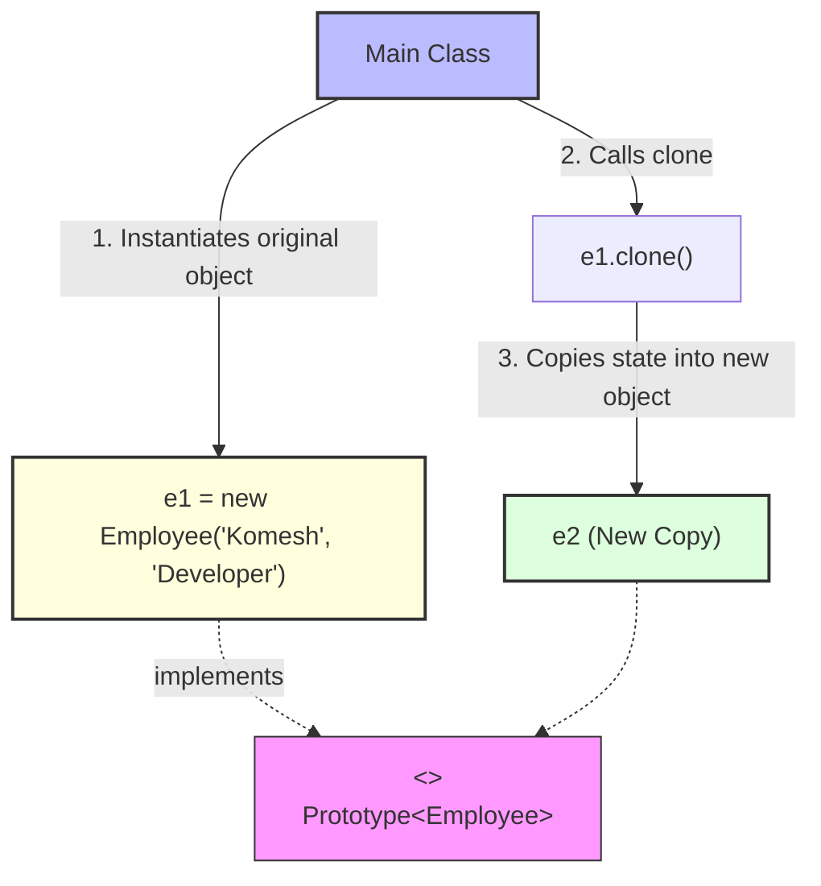

# Prototype Design Pattern

> **"Specify the kinds of objects to create using a prototypical instance, and create new objects by copying this prototype."** — *Gang of Four (GoF)*

---

## 📖 Introduction

The **Prototype Pattern** is a creational design pattern that allows copying existing objects without making your code dependent on their concrete classes. 

Instead of creating a new object from scratch using the `new` keyword (which might involve costly operations like database queries, external API calls, or heavy computations), the Prototype pattern creates a duplicate copy of an existing initialized instance (the prototype).

---

## 🛑 Problem Statement vs. Solution

### ❌ Without Prototype Pattern
Creating a new instance with identical state requires re-querying external sources or re-running expensive initialization logic:
```java
// Re-running initialization or constructor calls manually
Employee e2 = new Employee("Komesh", "Developer");
```

###  With Prototype Pattern
An existing object creates a copy of itself via its `clone()` contract:
```java
Employee e1 = new Employee("Komesh", "Developer");
Employee e2 = e1.clone(); // Fast duplication of state
```

---

## 🛠️ System Architecture & Mapping

| Component | Role | Description |
| :--- | :--- | :--- |
| **`Prototype<T>`** | Prototype Interface | Generic interface declaring the `clone()` method for type `T`. |
| **`Employee`** | Concrete Prototype | Class implementing `Prototype<Employee>` that knows how to clone itself. |
| **`Main`** | Client | Duplicates instances by calling `.clone()` on existing prototypes. |

---

## 🗺️ Architectural Workflow



---

## 🔍 Code Walkthrough

### 1. Custom Generic Prototype Interface (`Prototype.java`)
Unlike Java's legacy `Cloneable` interface (which relies on `Object.clone()` and throws `CloneNotSupportedException`), this custom generic interface provides type-safe cloning:
```java
public interface Prototype<T> {
    T clone();    
}
```

### 2. Concrete Prototype Implementation (`Employee.java`)
Implements `Prototype<Employee>` and defines the cloning behavior:
```java
public class Employee implements Prototype<Employee> {
    private String name;
    private String department;

    public Employee(String name, String department) {
        this.name = name;
        this.department = department;
    }

    @Override
    public Employee clone() {
        return new Employee(this.name, this.department);
    }

    @Override
    public String toString() {
        return name + " - " + department;
    }
}
```

### 3. Client Usage (`Main.java`)
```java
public class Main {
    public static void main(String[] args) {
        Employee e1 = new Employee("Komesh", "Developer");
        Employee e2 = e1.clone();

        System.out.println(e1); // Output: Komesh - Developer
        System.out.println(e2); // Output: Komesh - Developer
    }
}
```

---

## 💡 Key Benefits

1. **Performance Optimization**: Bypasses costly object initialization (e.g. database reads, file parsing) when creating copies.
2. **Type Safety**: Uses generic interface `Prototype<T>` to return exact target types without explicit type casting.
3. **Decoupling**: Client code can clone objects without needing to know their concrete implementation details.
