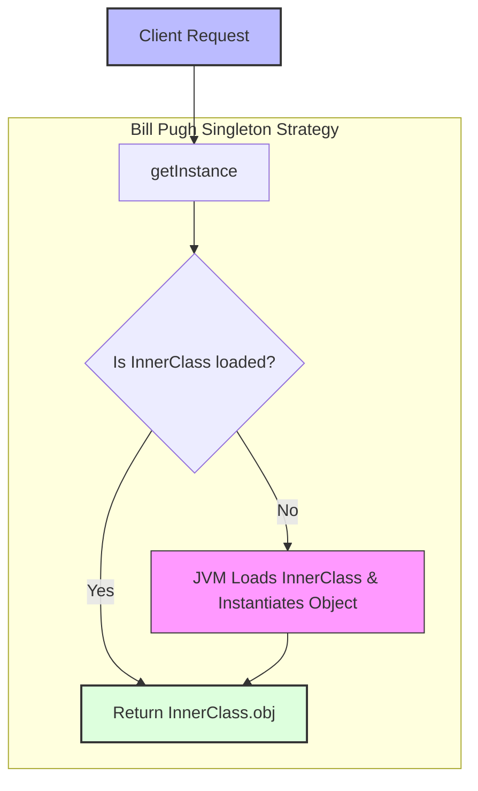

# Singleton Design Pattern

> **"Ensure a class has only one instance, and provide a global point of access to it."** — *Gang of Four (GoF)*

---

## 📖 Introduction

The **Singleton Pattern** is a creational design pattern that guarantees a class has only **one instance** throughout the application's runtime lifecycle while providing a global point of access to that instance.

Common use cases include shared system resources such as database connection pools, logger instances, hardware driver interfaces, and configuration managers.

This repository demonstrates **5 distinct implementations** of the Singleton pattern, comparing their initialization mechanics, thread-safety, and performance trade-offs.

---

## 📊 Comparison of Singleton Implementations

| Implementation | Class File | Lazy Loading | Thread Safe | Performance | Best Use Case |
| :--- | :--- | :---: | :---: | :---: | :--- |
| **1. Eager Loading** | `EagerLoading.java` | ❌ No |  Yes | ⚡⚡⚡ High | Simple singletons created early at startup with low resource footprint. |
| **2. Simple Lazy Loading** | `LazyLoading.java` |  Yes | ❌ No | ⚡⚡⚡ High | Single-threaded environments only. Unsafe for multi-threading! |
| **3. Synchronized Lazy** | `SynchronizedLazyLoading.java` |  Yes |  Yes | 🐌 Slow | Low-concurrency applications where method-level synchronization overhead is acceptable. |
| **4. Double-Checked Locking** | `DoubleCheckedLoading.java` |  Yes |  Yes | ⚡⚡ High | High-concurrency lazy initialization reducing lock overhead. |
| **5. Static Inner Class** | `StaticNestedInnerClass.java` |  Yes |  Yes | ⚡⚡⚡ High | **Recommended Production Standard** (Bill Pugh Singleton approach). |

---

## 🔍 Detailed Code & Architectural Breakdown

### 1. Eager Initialization (`EagerLoading.java`)
The instance is instantiated at class loading time by the JVM.

```java
class EagerLoading {
    private static final EagerLoading eagerLoading = new EagerLoading();

    private EagerLoading() {}

    public static EagerLoading getInstance() {
        return eagerLoading;
    }
}
```
- **Pros**: Simple, thread-safe guaranteed by JVM class loading.
- **Cons**: Instance is created even if the application never uses it, potentially wasting memory.

---

### 2. Simple Lazy Initialization (`LazyLoading.java`)
Delay instance creation until `getInstance()` is called for the first time.

```java
class LazyLoading {
    private static LazyLoading lazyLoading;

    private LazyLoading() {}

    public static LazyLoading getInstance() {
        if (lazyLoading == null)  
            lazyLoading = new LazyLoading();
        
        return lazyLoading;
    }
}
```
- **Pros**: Conserves memory until the instance is actually needed.
- **Cons**: **Not thread-safe**. If two threads enter `getInstance()` simultaneously when `lazyLoading == null`, two separate instances will be created!

---

### 3. Synchronized Lazy Initialization (`SynchronizedLazyLoading.java`)
Adds the `synchronized` keyword to `getInstance()`.

```java
class SynchronizedLazyLoading {
    private static SynchronizedLazyLoading lazyLoading;

    private SynchronizedLazyLoading() {}

    public static synchronized SynchronizedLazyLoading getInstance() {
        if (lazyLoading == null)  
            lazyLoading = new SynchronizedLazyLoading();
        
        return lazyLoading;
    }
}
```
- **Pros**: Thread-safe lazy initialization.
- **Cons**: Severe performance penalty. Synchronizing the entire method causes every call to lock, even after the instance is already instantiated.

---

### 4. Double-Checked Locking (`DoubleCheckedLoading.java`)
Synchronizes only the creation block using a double-null check.

```java
class DoubleCheckedLoading {
    private static DoubleCheckedLoading lazyLoading;

    private DoubleCheckedLoading() {}

    public static DoubleCheckedLoading getInstance() {
        if (lazyLoading == null) { // First check (no lock)
            synchronized(DoubleCheckedLoading.class) {
                if (lazyLoading == null) // Second check (with lock)
                    lazyLoading = new DoubleCheckedLoading();
            }
        }
        return lazyLoading;
    }
}
```
- **Pros**: Thread-safe and lazy-loaded. Locks only during initial creation.
- **Mechanism**: The outer `if` condition avoids locking once the instance exists; the inner `if` ensures only one thread instantiates when concurrent calls occur at initialization.

---

### 5. Static Nested Inner Class / Bill Pugh Singleton (`StaticNestedInnerClass.java`)
Leverages JVM class loading guarantees to achieve lazy loading and thread safety without explicit locks.

```java
class StaticNestedInnerClass {
    private StaticNestedInnerClass() {}

    // Static nested class is NOT loaded into memory until getInstance() is called
    private static class InnerClass {
        private static final StaticNestedInnerClass obj = new StaticNestedInnerClass();
    }

    public static StaticNestedInnerClass getInstance() {
        return InnerClass.obj;
    }
}
```
- **Pros**: **Best practice**. Lazy-loaded, 100% thread-safe (handled natively by JVM class loader), and zero synchronization overhead.

---

## 🗺️ Execution Workflow



---

## 💡 Key Takeaways

1. **Private Constructor**: Mandatory across all implementations to block outside `new` calls.
2. **Global Access Point**: Standard static method `getInstance()`.
3. **Evolution of Patterns**: Eager $\rightarrow$ Simple Lazy $\rightarrow$ Synchronized Method $\rightarrow$ Double-Checked Locking $\rightarrow$ Bill Pugh Inner Class.
