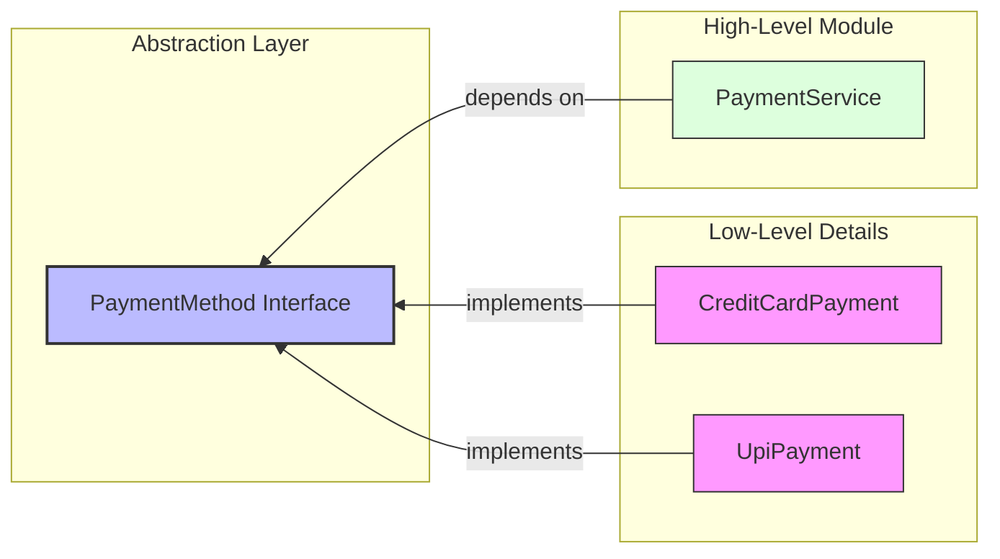

# Dependency Inversion Principle (DIP)

> **"High-level modules should not depend on low-level modules. Both should depend on abstractions."**
>
> **"Abstractions should not depend on details. Details should depend on abstractions."**
>
> — *Robert C. Martin*

---

## 📖 Introduction to DIP

The **Dependency Inversion Principle (DIP)** is the final principle of SOLID. It focuses on decoupling software modules. 

Traditionally, software systems are designed in a top-down approach where high-level modules (which contain business logic) directly depend on low-level modules (which handle data access, API calls, or payment gateways). 

DIP *inverts* this relationship. Instead of high-level classes depending directly on concrete low-level classes, both must depend on a shared **abstraction** (usually an interface or abstract class).

---

## ❌ The Anti-Pattern (Violating DIP)

To see the value of DIP, consider what happens when a high-level module directly creates and depends on a low-level module:

```java
// 🛑 VIOLATION OF DIP: High-level class directly depends on a concrete low-level class!
public class PaymentService {
    private CreditCardPayment creditCardPayment; // Tight coupling to a detail

    public PaymentService() {
        // Hardcoded dependency instantiation
        this.creditCardPayment = new CreditCardPayment();
    }

    public void checkout(double amount) {
        creditCardPayment.pay(amount);
    }
}
```

### Why is this bad?
1. **Rigidity**: If I want to support `UpiPayment` instead of `CreditCardPayment`, I must open `PaymentService` and modify its code.
2. **Untestable**: I cannot unit test `PaymentService` in isolation because it is tightly bound to `CreditCardPayment`.
3. **Detail Dependence**: The high-level business policy (`PaymentService`) is at the mercy of the implementation details of `CreditCardPayment`.

---

##  The Solution (My Implementation)

I resolved this coupling by introducing an abstraction layer: the `PaymentMethod` interface. 

### 🗺️ Inverted Dependency Flow

Instead of `PaymentService` pointing directly to concrete classes, the dependency direction is inverted. Both the service and the concrete payment classes point toward the `PaymentMethod` abstraction:



---

## 🔍 Code Walkthrough

### 1. The Abstraction: `PaymentMethod.java`
An interface defining the contractual capability to make a payment:
```java
interface PaymentMethod {
    void pay(double amount);
}
```

### 2. Concrete Details: `CreditCard.java` & `UpiPayment.java`
Low-level modules that implement the abstraction. (Note: `CreditCard.java` contains the class `CreditCardPayment`). They supply the specific implementation details for each payment type:
```java
class CreditCardPayment implements PaymentMethod { ... }
class UpiPayment implements PaymentMethod { ... }
```

### 3. High-Level Module: `PaymentService.java`
This class depends strictly on the `PaymentMethod` abstraction. It receives its concrete dependency at runtime via **Constructor Dependency Injection**:
```java
class PaymentService {
    private PaymentMethod paymentMethod; // Depends on abstraction, not detail

    public PaymentService(PaymentMethod paymentMethod) {
        this.paymentMethod = paymentMethod; // Injecting dependency
    }

    public void checkout(double amount) {
        paymentMethod.pay(amount);
    }
}
```

### 4. Client / Assembler: `Main.java`
The entry point instantiates the concrete classes and hooks them together:
```java
public class Main {
    public static void main(String[] args) {
        // Injecting CreditCardPayment
        PaymentService service = new PaymentService(new CreditCardPayment());
        service.checkout(5000);

        // Injecting UpiPayment
        service = new PaymentService(new UpiPayment());
        service.checkout(3000);
    }
}
```

---

## 🤝 OCP vs. DIP: How Are They Related?

It is common to notice that OCP and DIP look very similar in their class structures. Both utilize interfaces and polymorphism, but they address different architectural goals:

| Principle | Core Objective | Focus Area |
| :--- | :--- | :--- |
| **Open/Closed Principle (OCP)** | **Extensibility**: Ensuring new behaviors can be added without modifying existing code. | Code extension and safety from regression. |
| **Dependency Inversion Principle (DIP)** | **Decoupling**: Ensuring high-level business rules are independent of concrete implementation details. | Dependency management, pluggability, and testability. |

By designing my system around the `PaymentMethod` abstraction, **I have satisfied both OCP and DIP simultaneously**:
* **OCP**: I can add PayPal or cryptocurrency payments without changing existing classes.
* **DIP**: `PaymentService` is completely insulated from the details of card processing, bank integrations, or UPI APIs.

---

## 💡 Key Benefits of DIP

1. **Loose Coupling**: High-level modules are completely isolated from low-level implementation details.
2. **Easy Testing**: I can easily mock `PaymentMethod` to unit test `PaymentService` without needing actual card or bank processing.
3. **Pluggable System**: Swapping out UPI, Credit Card, or adding new services is seamless and requires zero code modifications in core services.
