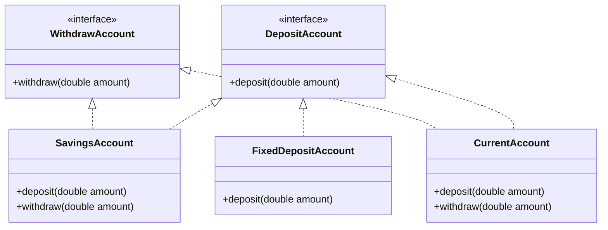

# Interface Segregation Principle (ISP)

> **"Clients should not be forced to depend upon interfaces they do not use."** — *Robert C. Martin*

---

## 📖 Introduction to ISP

The **Interface Segregation Principle (ISP)** states that it is better to have multiple, small, specific interfaces rather than a single, large, general-purpose interface. 

When an interface is too large (often called a **fat** or **polluted** interface), implementing classes are forced to write "dummy" implementations or throw `UnsupportedOperationException` for methods they don't actually need. This leads to fragile designs.

---

## ❌ The Anti-Pattern (Violating ISP)

Consider a single, monolithic `BankAccount` interface:

```java
// 🛑 VIOLATION OF ISP: A "fat" interface forcing all accounts to support withdrawal
public interface BankAccount {
    void deposit(double amount);
    void withdraw(double amount); // What if withdrawals are blocked or not allowed?
}
```

Now, if we create a `FixedDepositAccount` (where money is locked and cannot be withdrawn dynamically):

```java
// 🛑 Violating ISP: Forced to implement a method we do not use!
public class FixedDepositAccount implements BankAccount {
    public void deposit(double amount) {
        System.out.println("Money deposited.");
    }

    public void withdraw(double amount) {
        // Since withdrawals aren't allowed, we are forced to throw an exception or do nothing!
        throw new UnsupportedOperationException("Withdrawals are not allowed for Fixed Deposits!");
    }
}
```

This violates ISP because `FixedDepositAccount` is forced to depend on the `withdraw` method which it does not use.

---

##  The Solution (My Implementation)

I solved this problem by **segregating** the monolithic behavior into two highly cohesive, specialized interfaces:
1. **`DepositAccount`**: For accounts that accept deposits.
2. **`WithdrawAccount`**: For accounts that allow withdrawals.

### 🗺️ Class Hierarchy (ISP Compliant)



---

## 🔍 Code Walkthrough

### 1. Small Interfaces (The Segregation)
* **`DepositAccount.java`**: Declares only `deposit(double amount)`.
* **`WithdrawAccount.java`**: Declares only `withdraw(double amount)`.

### 2. Concrete Implementations
* **`SavingsAccount.java` & `CurrentAccount.java`**: Both savings and current accounts allow deposits and withdrawals, so they implement **both** interfaces:
  ```java
  public class SavingsAccount implements DepositAccount, WithdrawAccount { ... }
  ```
* **`FixedDepositAccount.java`**: A fixed deposit account only allows deposits, so it implements **only** `DepositAccount`:
  ```java
  public class FixedDepositAccount implements DepositAccount { ... }
  ```

### 3. Client Usage: `BankService.java`
The service defines separate methods that accept only the specific interface they need:
```java
public void processDeposit(DepositAccount account, double amount) {
    account.deposit(amount);
}

public void processWithdrawl(WithdrawAccount account, double amount) {
    account.withdraw(amount);
}
```

If we try to call `processWithdrawl` with a `FixedDepositAccount`:
```java
// 🛑 COMPILE-TIME ERROR: FixedDepositAccount cannot be cast to WithdrawAccount!
service.processWithdrawl(fixedDepositAccount, 2000);
```
The compiler prevents us from performing illegal operations, saving us from runtime crashes!

---

## 🤝 Why the Same Example is Used for both ISP and LSP

It is common to use this bank account example to explain both **Interface Segregation (ISP)** and **Liskov Substitution (LSP)** because **they are two sides of the same coin: violating ISP almost always forces a violation of LSP.**

### 1. The Interconnection in this Code
* **The ISP Violation:** I created a single "fat" interface `BankAccount` with `withdraw()`, forcing `FixedDepositAccount` to implement a method it doesn't need.
* **The LSP Violation:** Because of that ISP violation, `FixedDepositAccount` had to throw an `UnsupportedOperationException` in `withdraw()`. This means `FixedDepositAccount` can no longer be safely substituted for a `BankAccount` without causing a crash.

**By applying ISP (splitting the interface into `DepositAccount` and `WithdrawAccount`), the LSP violation is automatically fixed by ensuring no subclass inherits a method it can't execute.**

### 2. How They Differentiate

While both principles are satisfied by the same code refactoring, they examine the architecture from different angles:

| Feature | Interface Segregation Principle (ISP) | Liskov Substitution Principle (LSP) |
| :--- | :--- | :--- |
| **Primary Focus** | **The Interface Designer & Implementer's View** | **The Client (User of the Subclass) & Polymorphic View** |
| **Core Question** | *"Am I forcing classes to implement methods they don't want or need?"* | *"Can I safely substitute a subclass wherever the parent class is expected without breaking correctness?"* |
| **Violation Symptom** | A class has a dummy method or throws an exception for an interface requirement. | A client method crashes or behaves incorrectly when passed a specific subclass. |
| **Role in this Project** | I split `BankAccount` into `DepositAccount` and `WithdrawAccount`. | I restricted `processWithdrawl` to only accept `WithdrawAccount` subtypes, maintaining substitutability. |

---

## 💡 Key Benefits of ISP

1. **Compile-time Safety**: Instead of catching a runtime `UnsupportedOperationException`, the compiler blocks invalid operations at compile time.
2. **High Cohesion & Low Coupling**: Interfaces are small and focused on a single capability.
3. **Flexible Composition**: Classes can mix and match interface implementations based on their capabilities (e.g., a read-only account, write-only logging, etc.).

