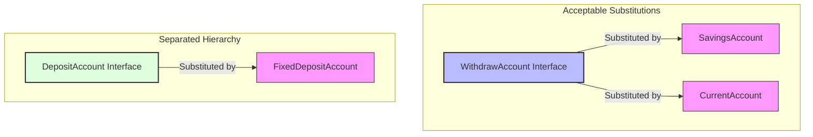

# Liskov Substitution Principle (LSP)

> **"Objects of a superclass should be replaceable with objects of its subclasses without affecting the correctness of the program."** — *Barbara Liskov*

---

## 📖 Introduction to LSP

The **Liskov Substitution Principle (LSP)** is a fundamental rule of object-oriented design that governs inheritance and subtyping. It states that if class `S` is a subtype of class `T`, then objects of type `T` should be replaceable with objects of type `S` without altering any of the desirable properties of the program (correctness, performance, etc.).

Essentially, **a subclass must honor the behavioral contract of its parent class**. If a subclass overrides a parent method in a way that breaks client expectations (e.g., throwing a runtime exception for unsupported operations), it violates LSP.

---

## ❌ The Anti-Pattern (Violating LSP)

Suppose we have a general base class or interface called `BankAccount` with `deposit` and `withdraw` methods, and a client method that processes withdrawals:

```java
public interface BankAccount {
    void deposit(double amount);
    void withdraw(double amount);
}
```

If we pass a `FixedDepositAccount` into a client function expecting `BankAccount`:

```java
// 🛑 VIOLATION OF LSP: Subclass breaks the parent class contract!
public class FixedDepositAccount implements BankAccount {
    public void deposit(double amount) {
        System.out.println("Money deposited.");
    }

    public void withdraw(double amount) {
        // Violating LSP: This throws an exception instead of performing the withdrawal
        throw new UnsupportedOperationException("Withdrawals are not allowed on Fixed Deposit Accounts!");
    }
}
```

### The Broken Client
Now, if a service loops through a list of all bank accounts and processes a withdrawal:
```java
public void processAllWithdrawals(List<BankAccount> accounts, double amount) {
    for (BankAccount account : accounts) {
        // 💥 CRASH! If a FixedDepositAccount is in the list, the application crashes.
        account.withdraw(amount); 
    }
}
```
In this scenario, `FixedDepositAccount` is **not substitutable** for `BankAccount` because replacing `BankAccount` with `FixedDepositAccount` changes the correctness of the program (causes a crash). This is a direct violation of LSP.

---

##  The Solution (My Implementation)

I resolved this by redesigning the type hierarchy. Instead of forcing `FixedDepositAccount` into an inheritance hierarchy that demands withdrawal support, I used **Client-Specific Interfaces** to model behavior.

### 🗺️ Substitutability Mapping



---

## 🔍 Code Walkthrough

### 1. Behavior segregation
* **`WithdrawAccount.java`**: The base contract specifically for withdrawable accounts.
* **`DepositAccount.java`**: The base contract specifically for depositable accounts.

### 2. LSP Compliance in Concrete Classes
* **`SavingsAccount.java`** & **`CurrentAccount.java`**: Both implement `WithdrawAccount`. Any class/method that expects a `WithdrawAccount` can receive a `SavingsAccount` or a `CurrentAccount` and it will behave exactly as expected (completing the withdrawal without throwing exceptions).
* **`FixedDepositAccount.java`**: **Does not implement** `WithdrawAccount`. By excluding it from the `WithdrawAccount` contract, there is a guarantee that a withdrawal will never be accidentally executed on a fixed deposit.

### 3. Client Verification in `BankService.java`
```java
public void processWithdrawl(WithdrawAccount account, double amount) {
    // Guaranteed to work! Every object passed here is an actual WithdrawAccount subclass
    account.withdraw(amount); 
}
```
Because `FixedDepositAccount` is not a subtype of `WithdrawAccount`, trying to pass it to `processWithdrawl` results in a compilation error:
```java
// service.processWithdrawl(fixedDepositAccount, 2000); // ❌ Won't compile!
```
By preventing this at compile time, we ensure that **every object that is accepted can be safely substituted**.

---

## 🤝 Why the Same Example is Used for both ISP and LSP

It is common to use this bank account example to explain both **Interface Segregation (ISP)** and **Liskov Substitution (LSP)** because **they are two sides of the same coin: violating ISP almost always forces a violation of LSP.**

### 1. The Interconnection in this Code
* **The ISP Violation:** I created a single "fat" interface `BankAccount` with `withdraw()`, forcing `FixedDepositAccount` to implement a method it doesn't need.
* **The LSP Violation:** Because of that ISP violation, `FixedDepositAccount` had to throw an `UnsupportedOperationException` in `withdraw()`. This means `FixedDepositAccount` can no longer be safely substituted for a `BankAccount` without causing a crash.

**By applying ISP (splitting the interface into `DepositAccount` and `WithdrawAccount`), the LSP violation is automatically fixed by ensuring no subclass inherits a method it can't execute.**

### 2. How They Differentiate

While both principles are satisfied by the same code refactoring, they examine the architecture from different angles:

| Feature | Interface Segregation Principle (ISP) | Liskov Substitution Principle (LSP) |
| :--- | :--- | :--- |
| **Primary Focus** | **The Interface Designer & Implementer's View** | **The Client (User of the Subclass) & Polymorphic View** |
| **Core Question** | *"Am I forcing classes to implement methods they don't want or need?"* | *"Can I safely substitute a subclass wherever the parent class is expected without breaking correctness?"* |
| **Violation Symptom** | A class has a dummy method or throws an exception for an interface requirement. | A client method crashes or behaves incorrectly when passed a specific subclass. |
| **Role in this Project** | I split `BankAccount` into `DepositAccount` and `WithdrawAccount`. | I restricted `processWithdrawl` to only accept `WithdrawAccount` subtypes, maintaining substitutability. |

---

## 💡 Key Rules to Keep LSP ( Barbara Liskov's Rules)

When extending the codebase, remember these rules to maintain LSP:
1. **No New Exceptions**: Subclasses should not throw exceptions that the parent class does not throw (unless they are subtypes of the parent's exceptions).
2. **Preconditions Cannot Be Strengthened**: Subclasses cannot require more strict input conditions than the parent.
3. **Postconditions Cannot Be Weakened**: Subclasses must deliver at least what the parent promised.
4. **Invariants Must Be Preserved**: Subclass modifications must keep the base class state consistent.

