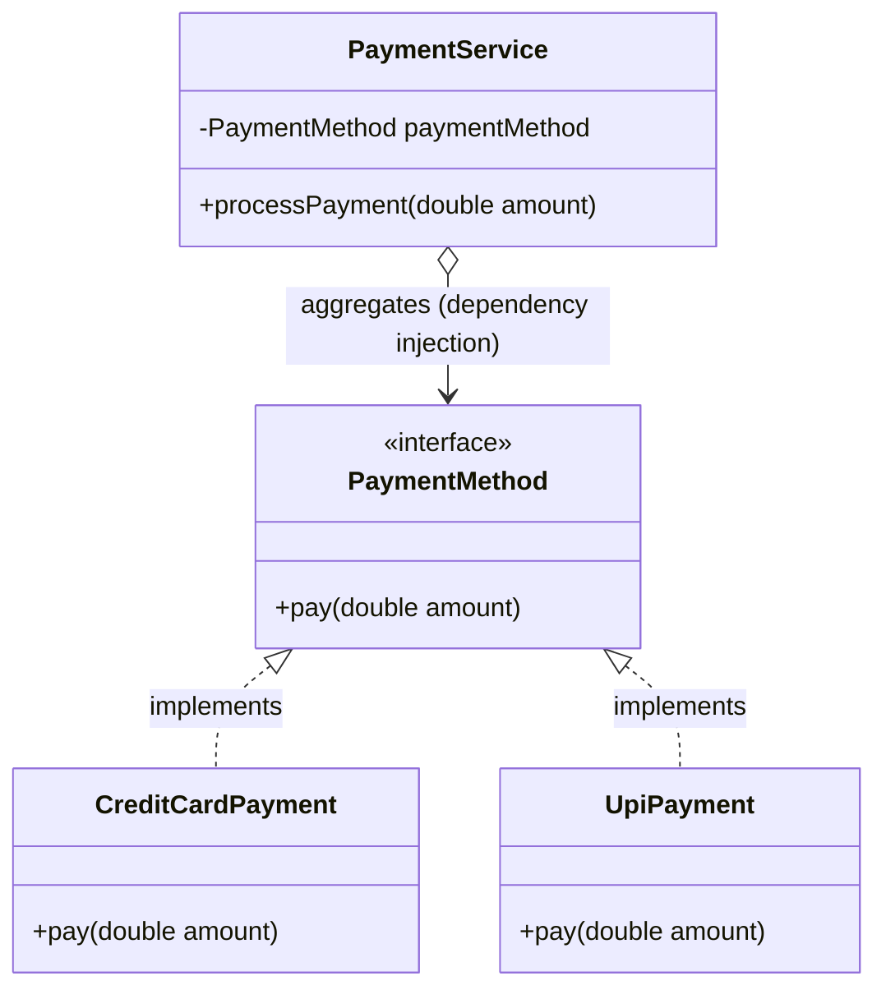

# Open/Closed Principle (OCP)

> **"Software entities (classes, modules, functions, etc.) should be open for extension, but closed for modification."** — *Bertrand Meyer*

---

## 📖 Introduction to OCP

The **Open/Closed Principle (OCP)** is the second principle of SOLID. It ensures that system behavior can be extended without changing the existing, tested codebase. 

- **Open for Extension**: New features or behaviors can be added to the system.
- **Closed for Modification**: Existing classes that are already compiled, tested, and running in production do not need to be changed.

---

## ❌ The Anti-Pattern (Violating OCP)

To see the value of OCP, consider how we would handle multiple payment methods **without** it. We would likely write a `PaymentService` class filled with conditional logic:

```java
// 🛑 VIOLATION OF OCP: Every time we add a new payment method, we MUST modify this class!
public class PaymentService {
    public void processPayment(String type, double amount) {
        if (type.equalsIgnoreCase("CREDIT_CARD")) {
            System.out.println("Amount paid using credit card");
        } else if (type.equalsIgnoreCase("UPI")) {
            System.out.println("Amount paid using upi");
        } else if (type.equalsIgnoreCase("PAYPAL")) {
            // Modifying this class to add PayPal support
            System.out.println("Amount paid using PayPal");
        }
        // What about Apple Pay? Crypto? NetBanking? The if-else block will grow forever.
    }
}
```
### Why is this bad?
1. **Risk of Regressions**: Editing `PaymentService` to add a new method might break existing payment methods.
2. **Hard to Maintain**: The class grows larger and harder to read over time.
3. **Tight Coupling**: The orchestrator is tightly coupled to specific payment implementations.

---

##  The Solution (My Implementation)

I resolved this by introducing **polymorphism** using a common interface.

### 🗺️ Class Diagram & Relationships



---

## 🔍 Code Walkthrough

1. **`PaymentMethod.java` (The Contract)**:
   An interface that declares the behavior `pay(double amount)`. Any class that wants to act as a payment method must implement this interface.
   
2. **`CreditCardPayment.java` & `UpiPayment.java` (The Implementations)**:
   Concrete classes that implement the `PaymentMethod` interface and define their specific payment execution steps.

3. **`PaymentService.java` (The Context/Service)**:
   This class is **completely agnostic** of the specific payment types. It operates on the `PaymentMethod` interface. It does not know or care if the payment is Credit Card, UPI, or something else. It simply executes `paymentMethod.pay(amount)`.

4. **`Main.java` (The Orchestrator)**:
   Instantiates the concrete payment class (`CreditCardPayment`) and injects it into the `PaymentService` at runtime.

---

## 🚀 How to Extend it (Demonstration)

If we want to support **PayPal Payments** tomorrow, we don't change `PaymentService.java`. We simply write a new class:

```java
// Open for Extension: We create a new file PayPalPayment.java
public class PayPalPayment implements PaymentMethod {
    @Override
    public void pay(double amount) {
        System.out.println("Amount paid using PayPal");
    }
}
```

Then we inject it in `Main.java`:

```java
PaymentService payment = new PaymentService(new PayPalPayment());
payment.processPayment(5000);
```

**Existing code is left untouched (Closed for Modification)**.

---

## 💡 Key Benefits of this Design

1. **Zero Regression Risk**: Since `PaymentService`, `CreditCardPayment`, and `UpiPayment` are not modified when adding new features, new bugs cannot be introduced into those modules.
2. **Pluggable Architecture**: Components can easily be swapped at runtime (e.g., dynamically choosing UPI or Credit Card based on user input).
3. **Clean Codebase**: Code is modular, highly cohesive, and easy to read.
