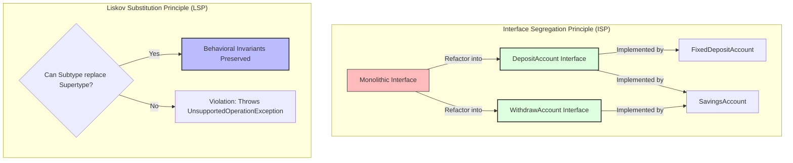

# SOLID Design Principles

> **"Building clean, maintainable, and extensible object-oriented systems."** — *Robert C. Martin ("Uncle Bob")*

---

## 📖 Overview

**SOLID** is a mnemonic acronym for five software design principles intended to make object-oriented designs more understandable, flexible, and maintainable. Applying these principles helps prevent code rot, reduces tight coupling, and ensures that codebases remain open to evolution without breaking existing functionality.

---

## 📚 SOLID Principles Summary Matrix

| Letter | Principle Name | Core Concept | Java Implementation |
| :---: | :--- | :--- | :--- |
| **S** | **[Single Responsibility Principle (SRP)](./SingleResponsibilityPrinciple)** | A class should have one, and only one, reason to change. | Decouples data, calculation, persistence, reporting, and notification logic for `Employee`. |
| **O** | **[Open/Closed Principle (OCP)](./OpenClosedPrinciple)** | Software entities should be open for extension, but closed for modification. | Extensible `PaymentMethod` interface allowing new payment modes without editing `PaymentService`. |
| **L** | **[Liskov Substitution Principle (LSP)](./LiskowSubstitutionPrinciple)** | Objects of a superclass should be replaceable with objects of its subclasses without breaking application logic. | Segregates `DepositAccount` and `WithdrawAccount` contracts so non-withdrawable accounts (e.g. `FixedDepositAccount`) don't throw unexpected runtime errors. |
| **I** | **[Interface Segregation Principle (ISP)](./InterfaceSegregationPrinciple)** | Clients should not be forced to depend upon interfaces that they do not use. | Splits large monolithic banking interface into granular `DepositAccount` and `WithdrawAccount` interfaces. |
| **D** | **[Dependency Inversion Principle (DIP)](./DependencyInversionPrinciple)** | High-level modules should depend on abstractions, not concrete implementations. | High-level `PaymentService` depends on `PaymentMethod` interface rather than concrete `CreditCard` or `UpiPayment` classes. |

---

## 📂 Repository Structure

```text
SolidPrinciples/
├── SingleResponsibilityPrinciple/ # 5 decoupled classes handling Employee state, salary, DB, report, and email
├── OpenClosedPrinciple/           # Extensible PaymentService using PaymentMethod strategy interface
├── LiskowSubstitutionPrinciple/    # Segregated account abstractions upholding LSP behavioral contracts
├── InterfaceSegregationPrinciple/  # Fine-grained DepositAccount & WithdrawAccount interfaces
└── DependencyInversionPrinciple/   # Inverted control flow using PaymentMethod abstraction
```

---

## 🛠️ Detailed Principle Breakdowns

### 1. 🎯 Single Responsibility Principle (SRP)
- **Concept**: Each class is assigned a single responsibility (one actor / one reason to change).
- **Implementation in Repo**:
  - `Employee.java`: Pure data carrier entity.
  - `EmployeeSalaryCalculator.java`: Business logic for bonus calculations.
  - `EmployeeRepository.java`: Database persistence operations.
  - `EmployeeReportGenerator.java`: Formatting console reports.
  - `EmployeeNotificationService.java`: Sending email/alert notifications.

### 2. 🔌 Open/Closed Principle (OCP)
- **Concept**: Extend system behavior by adding new classes rather than modifying existing tested code.
- **Implementation in Repo**:
  - `PaymentService.java` relies on `PaymentMethod` interface.
  - Adding `CreditCardPayment` or `UpiPayment` extends functionality without altering `PaymentService.pay()`.

### 3. 🔄 Liskov Substitution Principle (LSP)
- **Concept**: Subtypes must be completely substitutable for their base types without throwing unsupported exceptions or altering expected behavioral invariants.
- **Implementation in Repo**:
  - Eliminates anti-patterns where a `FixedDepositAccount` extends a generic `BankAccount` and throws `UnsupportedOperationException` on `withdraw()`.
  - Splitting account types ensures every class implementing `WithdrawAccount` actually supports withdrawals.

### 4. 🧩 Interface Segregation Principle (ISP)
- **Concept**: Prefer multiple small, client-specific interfaces over a single fat monolithic interface.
- **Implementation in Repo**:
  - Splits monolithic `BankService` into `DepositAccount` (`deposit()`) and `WithdrawAccount` (`withdraw()`).
  - Classes like `FixedDepositAccount` only implement `DepositAccount`, avoiding unused method pollution.

### 5. 🏗️ Dependency Inversion Principle (DIP)
- **Concept**: Both high-level and low-level modules must depend on abstractions. Abstractions should not depend upon details; details should depend upon abstractions.
- **Implementation in Repo**:
  - `PaymentService` receives `PaymentMethod` via dependency injection rather than directly instantiating `new CreditCard()` inside `PaymentService`.

---

## 🔍 Comparative Analysis: ISP vs. LSP

While **ISP** and **LSP** often address related structural issues in class hierarchies, they focus on different aspects of object-oriented design:



1. **ISP Focus (Interface Design)**: Eliminates interface pollution. Prevents classes from being forced to implement contract methods they do not need.
2. **LSP Focus (Behavioral Correctness)**: Guarantees polymorphic substitutability. Ensures that substituting a subclass for a parent interface does not crash client code or violate contract expectations.
3. **Synergy**: Applying ISP to split interfaces often naturally enables adherence to LSP by preventing dummy/unsupported method implementations.

---

## 💻 How to Compile and Run

From the repository root:

```bash
# Run SRP Example
javac SolidPrinciples/SingleResponsibilityPrinciple/*.java
java SolidPrinciples.SingleResponsibilityPrinciple.Main

# Run OCP Example
javac SolidPrinciples/OpenClosedPrinciple/*.java
java SolidPrinciples.OpenClosedPrinciple.Main

# Run DIP Example
javac SolidPrinciples/DependencyInversionPrinciple/*.java
java SolidPrinciples.DependencyInversionPrinciple.Main
```
