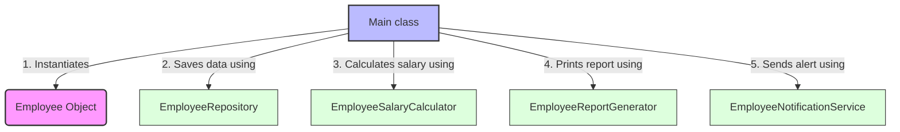

# Single Responsibility Principle (SRP)

> **"A class should have one, and only one, reason to change."** — *Robert C. Martin*

---

## 📖 Introduction to SRP

The **Single Responsibility Principle (SRP)** is the first principle of the SOLID design guidelines. It states that a class should be responsible for only **one actor** or **one domain of functionality**. 

If a class has multiple responsibilities, it becomes tightly coupled and fragile. A change in one requirement (e.g., database schema) might accidentally break another unrelated functionality (e.g., report formatting) because they live in the same class.

---

## ❌ The Anti-Pattern (Violating SRP)

To understand why my code is well-structured, look at what happens when we **violate** SRP. Imagine a single `Employee` class that tries to do everything:

```java
// 🛑 VIOLATION OF SRP: This class has too many reasons to change!
public class Employee {
    private String name;
    private String email;
    private double baseSalary;

    // 1. Data/Entity Responsibility
    // Getters and Setters...

    // 2. Calculation Responsibility (If tax rules change, we modify this class)
    public double calculateSalaryWithBonus() {
        return baseSalary + (baseSalary * 0.1);
    }

    // 3. Database/Persistence Responsibility (If we change Database/SQL, we modify this class)
    public void saveToDatabase() {
        System.out.println("Saving employee to DB...");
    }

    // 4. Reporting/Formatting Responsibility (If UI/formatting changes, we modify this class)
    public void displayReport() {
        System.out.println("Employee Name: " + name);
    }

    // 5. Notification Responsibility (If we switch from Email to SMS/Slack, we modify this class)
    public void sendEmailNotification() {
        System.out.println("Emailing salary report...");
    }
}
```

---

##  The Solution (My Implementation)

I have successfully decoupled these responsibilities into **5 distinct, specialized classes**. Here is how they map to their individual responsibilities:

| Class Name | Primary Responsibility | Reason to Change |
| :--- | :--- | :--- |
| **`Employee`** | Data Carrier (State & Properties) | Changing the core fields/attributes of an employee. |
| **`EmployeeSalaryCalculator`**| Business Logic (Salary calculations) | Changing the bonus calculation formula or salary rules. |
| **`EmployeeRepository`** | Persistence Layer (Data Access) | Changing how or where employee data is saved (e.g., SQL DB, MongoDB, File). |
| **`EmployeeReportGenerator`** | Presentation/UI Layer (Formatting) | Changing how the employee report is formatted or displayed. |
| **`EmployeeNotificationService`** | Communication Layer (Alerts) | Changing the notification channel (e.g., Email, SMS, Slack). |

---

## 🗺️ Architectural Workflow

Here is how the components interact in the `Main.java` orchestrator:



---

## 🔍 Code Walkthrough

### 1. The Entity: `Employee.java`
Keeps track of name, email, and base salary. It has **no** business logic, database queries, or printing logic. It is a pure POJO (Plain Old Java Object).

### 2. Business Logic: `EmployeeSalaryCalculator.java`
Contains a method `bonusSalary(Employee emp)` to calculate bonuses ($10\%$). If bonus percentages change, only this class is modified.

### 3. Persistence: `EmployeeRepository.java`
Handles the database representation and operations. The `save(Employee emp)` method simulates writing to a database.

### 4. Presentation: `EmployeeReportGenerator.java`
Handles console output formatting. If there is a need to export reports to HTML or PDF in the future, only this class needs to be edited or extended.

### 5. Notification: `EmployeeNotificationService.java`
Sends alerts. If there is a decision to send WhatsApp messages instead of standard outputs, this is the only code block to edit.

---

## 💡 Key Benefits of this Design

1. **Maintainability**: If the database team requests a change from SQL to NoSQL, only `EmployeeRepository` needs to be modified, with no risk of breaking the salary calculations.
2. **Reusability**: `EmployeeRepository` can be reused in a web controller, and `EmployeeSalaryCalculator` in a payroll module independently.
3. **Testability**: Clean unit tests can be written for `EmployeeSalaryCalculator` without needing to mock or spin up database services.
4. **Collision-free Teamwork**: Different developers can work on `EmployeeRepository` and `EmployeeReportGenerator` at the same time without encountering Git merge conflicts in the same file.
