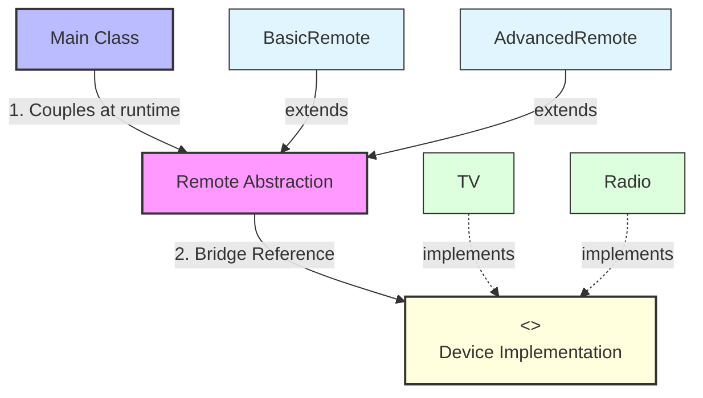

# Bridge Design Pattern

> **"Decouple an abstraction from its implementation so that the two can vary independently."** — *Gang of Four (GoF)*

---

## 📖 Introduction

The **Bridge Pattern** is a structural design pattern that splits a large class hierarchy into two separate, independent hierarchies: **Abstraction** (high-level control logic) and **Implementation** (low-level platform-specific execution). These two hierarchies communicate across a "Bridge" interface reference.

Without the Bridge pattern, combining multiple abstraction controls (e.g., `BasicRemote`, `AdvancedRemote`) with multiple implementation platforms (e.g., `TV`, `Radio`, `AC`) leads to a Cartesian product class explosion ($N \times M$ subclasses like `BasicRemoteTV`, `AdvancedRemoteTV`, `BasicRemoteRadio`, `AdvancedRemoteRadio`). The Bridge pattern converts this multiplication into an addition ($N + M$ classes) by replacing inheritance with composition.

---

## 🛑 Problem Statement vs. Solution

### ❌ Class Explosion (Cartesian Inheritance Anti-Pattern)
Inheriting abstraction and implementation together causes an exponential proliferation of classes:
```java
// Requires N x M concrete classes for every remote-device combination!
class BasicRemoteTV extends TV { ... }
class AdvancedRemoteTV extends TV { ... }
class BasicRemoteRadio extends Radio { ... }
class AdvancedRemoteRadio extends Radio { ... }
```

###  With Bridge Pattern (Decoupled Hierarchies via Composition)
Abstractions (`Remote`) hold a reference to an implementation interface (`Device`). Both hierarchies can evolve independently without breaking each other:
```java
// Flexible combination at runtime: N + M classes total
Device tv = new TV();
Remote basicRemote = new BasicRemote(tv);
basicRemote.powerOn();

Device radio = new Radio();
Remote advancedRemote = new AdvancedRemote(radio);
advancedRemote.powerOn();
((AdvancedRemote) advancedRemote).mute();
```

---

## 🛠️ System Architecture & Mapping

| Component | Role | Description |
| :--- | :--- | :--- |
| **`Device`** | Implementation Interface | Common interface declaring low-level platform operations (`turnOn()`, `turnOff()`, `volumeUp()`, `volumeDown()`). |
| **`TV`** | Concrete Implementation 1 | Concrete platform implementing `Device` for television sets. |
| **`Radio`** | Concrete Implementation 2 | Concrete platform implementing `Device` for radio sets. |
| **`Remote`** | Abstraction | High-level control abstraction containing a reference (`protected Device device`) across the bridge. |
| **`BasicRemote`** | Refined Abstraction 1 | Standard control remote inheriting from `Remote`. |
| **`AdvancedRemote`** | Refined Abstraction 2 | Extended remote adding extra functionality (`mute()`). |
| **`Main`** | Client | Pairs refined remotes with target devices dynamically. |

---

## 🗺️ Architectural Workflow



---

## 🔍 Code Walkthrough

### 1. Implementation Interface (`Device.java`)
Defines low-level operations for all concrete devices:
```java
package StructuralDesignPatterns.BridgePattern;

public interface Device {
    
    void turnOn();
    void turnOff();
    void volumeUp();
    void volumeDown();
}
```

### 2. Concrete Implementations
Platform-specific implementations of the `Device` interface:

- **`TV.java`**:
  ```java
  public class TV implements Device {

      @Override
      public void turnOn() {
          System.out.println("TV ON");
      }

      @Override
      public void turnOff() {
          System.out.println("TV OFF");
      }

      @Override
      public void volumeUp() {
          System.out.println("TV Volume +");
      }

      @Override
      public void volumeDown() {
          System.out.println("TV Volume -");
      }
  }
  ```

- **`Radio.java`**:
  ```java
  public class Radio implements Device {

      @Override
      public void turnOn() {
          System.out.println("Radio ON");
      }

      @Override
      public void turnOff() {
          System.out.println("Radio OFF");
      }

      @Override
      public void volumeUp() {
          System.out.println("Radio Volume +");
      }

      @Override
      public void volumeDown() {
          System.out.println("Radio Volume -");
      }
  }
  ```

### 3. Abstraction (`Remote.java`)
Defines high-level control logic and maintains the Bridge reference to `Device`:
```java
package StructuralDesignPatterns.BridgePattern;

public abstract class Remote {

    protected Device device;

    public Remote(Device device) {
        this.device = device;
    }

    public void powerOn() {
        device.turnOn();
    }

    public void powerOff() {
        device.turnOff();
    }

    public void volumeUp() {
        device.volumeUp();
    }

    public void volumeDown() {
        device.volumeDown();
    }
}
```

### 4. Refined Abstractions
Extends control logic without touching device implementation details:

- **`BasicRemote.java`**:
  ```java
  public class BasicRemote extends Remote {

      public BasicRemote(Device device) {
          super(device);
      }
  }
  ```

- **`AdvancedRemote.java`**:
  ```java
  public class AdvancedRemote extends Remote {

      public AdvancedRemote(Device device) {
          super(device);
      }

      public void mute() {
          System.out.println("Muting Device...");
      }
  }
  ```

### 5. Client Usage (`Main.java`)
Pairs remotes and devices independently at runtime:
```java
package StructuralDesignPatterns.BridgePattern;

public class Main {

    public static void main(String[] args) {

        Device tv = new TV();
        Remote remote = new BasicRemote(tv);
        remote.powerOn();
        remote.volumeUp();

        System.out.println();

        Device radio = new Radio();
        Remote remote2 = new AdvancedRemote(radio);
        remote2.powerOn();
        remote2.volumeDown();

        ((AdvancedRemote) remote2).mute();
    }
}
```

---

## 💡 Key Benefits

1. **Decoupled Abstraction & Implementation**: High-level control logic and low-level platform code can be updated independently.
2. **Prevents Class Explosion**: Reduces class growth from exponential ($N \times M$) to linear ($N + M$).
3. **Open/Closed Principle (OCP)**: New remotes (e.g., `TouchRemote`) or new devices (e.g., `AC`) can be introduced independently without altering existing code.
4. **Single Responsibility Principle (SRP)**: High-level abstraction handles control flow, while low-level implementation handles device mechanics.
