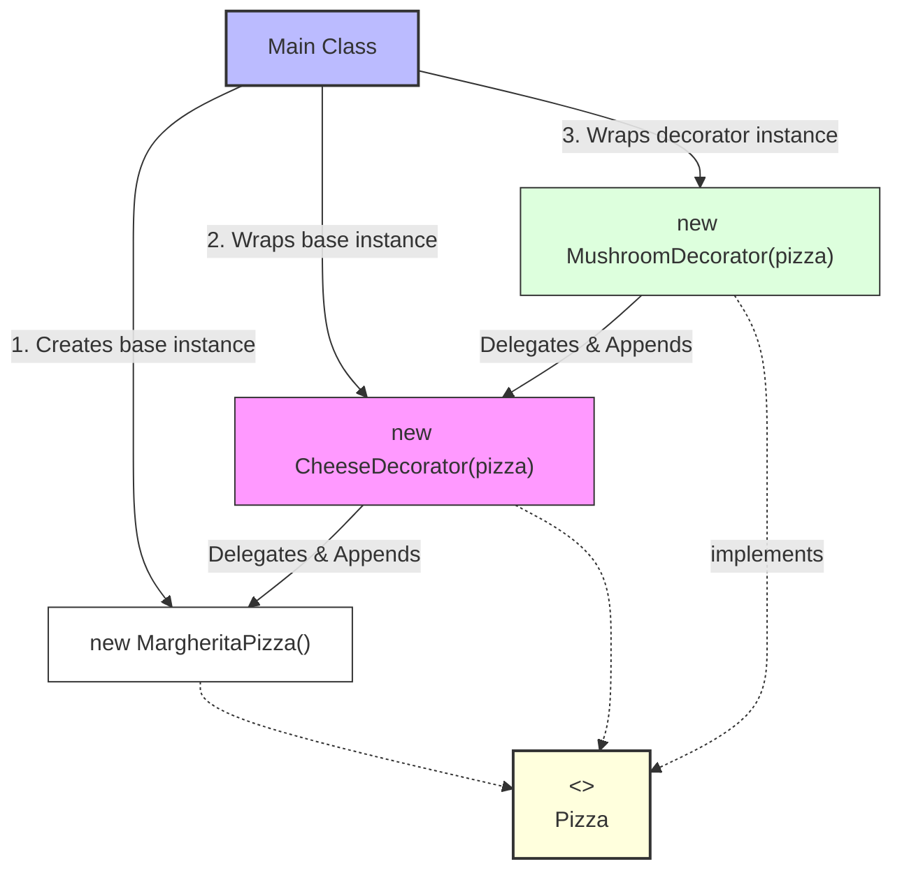

# Decorator Design Pattern

> **"Attach additional responsibilities to an object dynamically. Decorators provide a flexible alternative to subclassing for extending functionality."** — *Gang of Four (GoF)*

---

## 📖 Introduction

The **Decorator Pattern** is a structural design pattern that allows behavior to be added to an individual object, dynamically at runtime, without affecting the behavior of other objects from the same class.

Instead of relying on static class inheritance (which leads to a class explosion when combining multiple optional features), the Decorator pattern uses object composition. Decorator classes wrap the base component object and mirror its interface, delegating calls to the wrapped instance while adding custom pre- or post-processing behavior.

---

## 🛑 Problem Statement vs. Solution

### ❌ Class Explosion (Inheritance Anti-Pattern)
Attempting to handle feature combinations via traditional inheritance results in an unmanageable number of subclasses:
```java
// Combining toppings requires endless concrete subclasses
Pizza pizza1 = new MargheritaWithCheese();
Pizza pizza2 = new MargheritaWithCheeseAndMushroom();
Pizza pizza3 = new MargheritaWithDoubleCheeseAndMushroom(); // Rigid & maintenance nightmare!
```

###  With Decorator Pattern
Decorators can be nested and chained dynamically in any combination at runtime:
```java
// Flexible dynamic composition wrapping objects at runtime
Pizza pizza = new MargheritaPizza();
pizza = new CheeseDecorator(pizza);   // Wraps base pizza with Cheese
pizza = new MushroomDecorator(pizza); // Wraps CheeseDecorator with Mushroom

System.out.println(pizza.getDescription()); // Margherita Pizza, Extra Cheese, Mushroom
System.out.println(pizza.getCost());        // 290.0
```

---

## 🛠️ System Architecture & Mapping

| Component | Role | Description |
| :--- | :--- | :--- |
| **`Pizza`** | Component Interface | Declares the common interface for base objects and decorators (`getDescription()`, `getCost()`). |
| **`MargheritaPizza`** | Concrete Component | Base object to which additional responsibilities can be attached dynamically. |
| **`PizzaDecorator`** | Base Decorator | Abstract class implementing `Pizza` and holding a reference (`protected Pizza pizza`) to a wrapped instance. |
| **`CheeseDecorator`** | Concrete Decorator 1 | Adds extra cheese topping cost (`+50`) and description tag. |
| **`MushroomDecorator`** | Concrete Decorator 2 | Adds mushroom topping cost (`+40`) and description tag. |
| **`Main`** | Client | Dynamically layers decorators onto a base pizza object. |

---

## 🗺️ Architectural Workflow



---

## 🔍 Code Walkthrough

### 1. Component Interface (`Pizza.java`)
Defines the uniform interface for both concrete components and decorators:
```java
package StructuralDesignPatterns.DecoratorPattern;

public interface Pizza {
    String getDescription();
    double getCost();   
}
```

### 2. Concrete Component (`MargheritaPizza.java`)
The core object being decorated:
```java
package StructuralDesignPatterns.DecoratorPattern;

public class MargheritaPizza implements Pizza {

    @Override
    public String getDescription() {
        return "Margherita Pizza";
    }

    @Override
    public double getCost() {
        return 200;
    }
}
```

### 3. Abstract Decorator (`PizzaDecorator.java`)
Maintains a reference to a wrapped `Pizza` object:
```java
package StructuralDesignPatterns.DecoratorPattern;

public abstract class PizzaDecorator implements Pizza {
    
    protected Pizza pizza;

    public PizzaDecorator(Pizza pizza) {
        this.pizza = pizza;
    }
}
```

### 4. Concrete Decorators
Enhance behavior by augmenting wrapped call results:
- **`CheeseDecorator.java`**:
  ```java
  public class CheeseDecorator extends PizzaDecorator {

      public CheeseDecorator(Pizza pizza) {
          super(pizza);
      }

      @Override
      public String getDescription() {
          return pizza.getDescription() + ", Extra Cheese";
      }

      @Override 
      public double getCost() {
          return pizza.getCost() + 50;
      }
  }
  ```

- **`MushroomDecorator.java`**:
  ```java
  public class MushroomDecorator extends PizzaDecorator {

      public MushroomDecorator(Pizza pizza) {
          super(pizza);
      }

      @Override
      public String getDescription() {
          return pizza.getDescription() + ", Mushroom";
      }

      @Override
      public double getCost() {
          return pizza.getCost() + 40;
      }
  }
  ```

### 5. Client Usage (`Main.java`)
Demonstrates nesting multiple decorators at runtime:
```java
package StructuralDesignPatterns.DecoratorPattern;

public class Main {
    public static void main(String[] args) {
        Pizza pizza = new MargheritaPizza();

        pizza = new CheeseDecorator(pizza);
        pizza = new MushroomDecorator(pizza);

        System.out.println(pizza.getDescription()); // Margherita Pizza, Extra Cheese, Mushroom
        System.out.println(pizza.getCost());        // 290.0
    }
}
```

---

## 💡 Key Benefits

1. **Greater Flexibility than Static Inheritance**: Enhancements can be dynamically added or removed at runtime without compiling new subclasses.
2. **Prevents Class Explosion**: Eliminates the need for creating separate subclasses for every possible feature combination.
3. **Single Responsibility Principle (SRP)**: Complex, multi-feature classes can be divided into smaller, single-purpose decorator classes.
