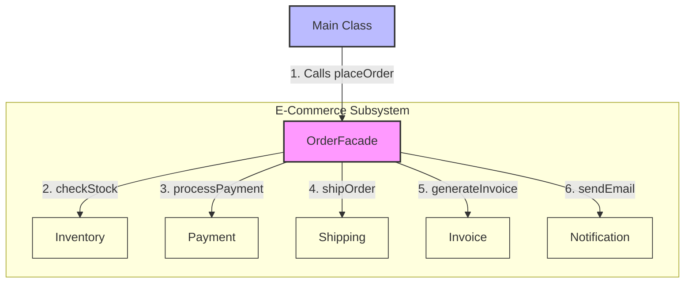

# Facade Design Pattern

> **"Provide a unified interface to a set of interfaces in a subsystem. Facade defines a higher-level interface that makes the subsystem easier to use."** — *Gang of Four (GoF)*

---

## 📖 Introduction

The **Facade Pattern** is a structural design pattern that provides a simplified, higher-level interface to a complex subsystem composed of multiple interdependent classes.

In complex enterprise applications (such as e-commerce fulfillment platforms), completing a single user task like placing an order requires orchestrating multiple subsystem operations: checking stock in inventory, processing payment, scheduling shipping, generating invoices, and sending email notifications. Without a Facade, client code must manually instantiate, configure, and manage execution order across all subsystem components. The Facade pattern encapsulates this complexity behind a single, clean method call.

---

## 🛑 Problem Statement vs. Solution

### ❌ Without Facade Pattern (Complex Subsystem Management)
Client code must directly manage every individual subsystem class, leading to tight coupling, duplication, and error-prone code:
```java
// Client logic cluttered with subsystem instantiation and workflow management
Inventory inventory = new Inventory();
if (inventory.checkStock()) {
    Payment payment = new Payment();
    payment.processPayment();

    Shipping shipping = new Shipping();
    shipping.shipOrder();

    Invoice invoice = new Invoice();
    invoice.generateInvoice();

    Notification notification = new Notification();
    notification.sendEmail();
}
```

###  With Facade Pattern
Client code delegates execution to a unified facade (`OrderFacade`) through a single method call (`placeOrder()`):
```java
// Clean, decoupled, and easy-to-use client interface
OrderFacade facade = new OrderFacade();
facade.placeOrder();
```

---

## 🛠️ System Architecture & Mapping

| Component | Role | Description |
| :--- | :--- | :--- |
| **`OrderFacade`** | Facade Class | Provides a unified entry point (`placeOrder()`) encapsulating the workflow across all subsystems. |
| **`Inventory`** | Subsystem 1 | Checks stock availability (`checkStock()`). |
| **`Payment`** | Subsystem 2 | Processes financial transactions (`processPayment()`). |
| **`Shipping`** | Subsystem 3 | Coordinates order logistics (`shipOrder()`). |
| **`Invoice`** | Subsystem 4 | Generates billing documentation (`generateInvoice()`). |
| **`Notification`** | Subsystem 5 | Dispatches customer email alerts (`sendEmail()`). |
| **`Main`** | Client | Interacts solely with `OrderFacade` to execute orders. |

---

## 🗺️ Architectural Workflow



---

## 🔍 Code Walkthrough

### 1. Subsystem Components
Independent classes responsible for specific domain tasks:

- **`Inventory.java`**:
  ```java
  public class Inventory {
      public boolean checkStock() throws InterruptedException {
          Thread.sleep(3000);
          System.out.println("Checking stock... ");
          return true;
      }
  }
  ```

- **`Payment.java`**:
  ```java
  public class Payment {
      public void processPayment() throws InterruptedException {
          Thread.sleep(2000);
          System.out.println("Payment successful");
      }
  }
  ```

- **`Shipping.java`**:
  ```java
  public class Shipping {
      public void shipOrder() throws InterruptedException {
          Thread.sleep(2000);
          System.out.println("Shipping Order");
      }
  }
  ```

- **`Invoice.java`**:
  ```java
  public class Invoice {
      public void generateInvoice() throws InterruptedException {
          Thread.sleep(3000);
          System.out.println("Invoice Generated");
      }
  }
  ```

- **`Notification.java`**:
  ```java
  public class Notification {
      public void sendEmail() throws InterruptedException {
          Thread.sleep(2000);
          System.out.println("Email Sent");
      }
  }
  ```

### 2. Facade Component (`OrderFacade.java`)
Aggregates subsystem references and orchestrates the order processing sequence:
```java
package StructuralDesignPatterns.FacadePattern;

public class OrderFacade {
    
    private Inventory inventory;
    private Payment payment;
    private Shipping shipping;
    private Invoice invoice;
    private Notification notification;

    public OrderFacade() {
        inventory = new Inventory();
        payment = new Payment();
        shipping = new Shipping();
        invoice = new Invoice();
        notification = new Notification();
    }

    public void placeOrder() throws InterruptedException {
        if (inventory.checkStock()) {
            payment.processPayment();
            shipping.shipOrder();
            invoice.generateInvoice();
            notification.sendEmail();
            System.out.println("Order completed Successfully");
        }
    }
}
```

### 3. Client Entry Point (`Main.java`)
Client interacts strictly with the `OrderFacade` without needing knowledge of underlying subsystems:
```java
package StructuralDesignPatterns.FacadePattern;

public class Main {
    
    public static void main(String[] args) throws InterruptedException {
        OrderFacade facade = new OrderFacade();
        facade.placeOrder();
    }
}
```

---

## 💡 Key Benefits

1. **Loose Coupling**: Shields clients from subsystem components, reducing the number of dependencies the client must manage.
2. **Simplified Interface**: Exposes a clean, high-level API (`placeOrder()`) for complex workflows without hiding lower-level subsystem classes if advanced direct access is needed.
3. **Improved Maintainability**: Subsystem changes or internal workflow updates can be made inside the `OrderFacade` without breaking client code.
