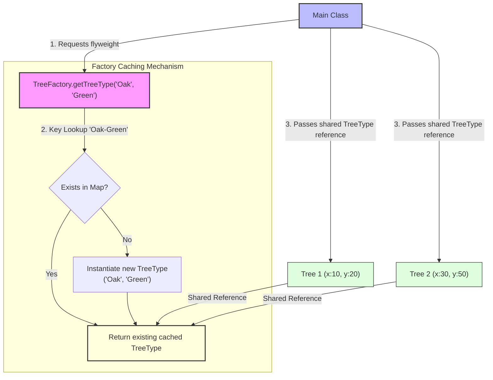

# Flyweight Design Pattern

> **"Use sharing to support large numbers of fine-grained objects efficiently."** — *Gang of Four (GoF)*

---

## 📖 Introduction

The **Flyweight Pattern** is a structural design pattern that enables massive memory optimization by sharing common, immutable state (**Intrinsic State**) across large numbers of fine-grained objects, while keeping instance-specific state (**Extrinsic State**) separate.

When rendering heavy graphical systems (like a forest containing 1,000,000 trees in a game or video editor), duplicating heavy texture, mesh, name, and color data for every single object instance leads to memory exhaustion. The Flyweight pattern extracts the shared, invariant attributes into a Flyweight object (`TreeType`) managed by a factory cache (`TreeFactory`), leaving only unique coordinates (`x`, `y`) inside individual context objects (`Tree`).

---

## 🛑 Problem Statement vs. Solution

### ❌ Without Flyweight Pattern (Duplicate Heavy Intrinsic Data)
Creating 1,000,000 `Tree` objects with duplicate name and color strings consumes massive RAM:
```java
// Duplicates "Oak" and "Green" string objects 1,000,000 times in memory!
Tree tree1 = new Tree(10, 20, "Oak", "Green");
Tree tree2 = new Tree(30, 50, "Oak", "Green");
```

###  With Flyweight Pattern (Shared Intrinsic State via Factory Cache)
Intrinsic state (`TreeType`) is instantiated once per unique combination and shared across millions of tree contexts:
```java
// "Oak-Green" TreeType created ONCE and reused across all matching tree instances
TreeType oakType = TreeFactory.getTreeType("Oak", "Green");

Tree tree1 = new Tree(10, 20, oakType);
Tree tree2 = new Tree(30, 50, oakType); // Reuses same oakType instance in memory
```

---

## 🛠️ System Architecture & Mapping

| Component | Role | Description |
| :--- | :--- | :--- |
| **`TreeType`** | Flyweight (Intrinsic) | Holds shared, immutable state (`name`, `color`) and accepts extrinsic state (`x`, `y`) as method parameters during execution (`draw(x, y)`). |
| **`Tree`** | Context (Extrinsic) | Holds unique per-instance coordinates (`x`, `y`) and maintains a reference to a shared `TreeType` flyweight. |
| **`TreeFactory`** | Flyweight Factory | Manages a pool (`Map<String, TreeType>`) of existing flyweight objects to guarantee reuse. |
| **`Main`** | Client | Requests flyweights from `TreeFactory` and constructs context `Tree` objects. |

---

## 🗺️ Architectural Workflow



---

## 🔍 Code Walkthrough

### 1. Flyweight Component (`TreeType.java` - Intrinsic State)
Contains invariant properties shared by many trees:
```java
package StructuralDesignPatterns.FlyweightPattern;

public class TreeType {

    private String name;
    private String color;

    public TreeType(String name, String color) {
        this.name = name;
        this.color = color;
    }

    public void draw(int x, int y) {
        System.out.println(
                "Drawing " + name +
                " Tree at (" + x + "," + y + ")" +
                " Color: " + color
        );
    }
}
```

### 2. Context Component (`Tree.java` - Extrinsic State)
Holds unique per-instance state (`x`, `y`) and delegates drawing to the flyweight:
```java
package StructuralDesignPatterns.FlyweightPattern;

public class Tree {

    private int x;
    private int y;
    private TreeType type;

    public Tree(int x, int y, TreeType type) {
        this.x = x;
        this.y = y;
        this.type = type;
    }

    public void draw() {
        type.draw(x, y);
    }
}
```

### 3. Flyweight Factory (`TreeFactory.java`)
Caches and reuses existing `TreeType` instances based on a composite key (`name-color`):
```java
package StructuralDesignPatterns.FlyweightPattern;

import java.util.HashMap;
import java.util.Map;

public class TreeFactory {

    private static final Map<String, TreeType> treeTypes = new HashMap<>();

    public static TreeType getTreeType(String name, String color) {

        String key = name + "-" + color;

        if (!treeTypes.containsKey(key)) {
            treeTypes.put(key, new TreeType(name, color));
            System.out.println("Created New TreeType");
        }

        return treeTypes.get(key);
    }
}
```

### 4. Client Usage (`Main.java`)
Instantiates multiple trees while reusing shared `TreeType` objects:
```java
package StructuralDesignPatterns.FlyweightPattern;

public class Main {

    public static void main(String[] args) {

        Tree tree1 = new Tree(10, 20, TreeFactory.getTreeType("Oak", "Green"));
        Tree tree2 = new Tree(30, 50, TreeFactory.getTreeType("Oak", "Green"));
        Tree tree3 = new Tree(60, 90, TreeFactory.getTreeType("Pine", "Dark Green"));

        tree1.draw();
        tree2.draw();
        tree3.draw();
    }
}
```

---

## 💡 Key Benefits

1. **Massive RAM Optimization**: Reduces memory consumption dramatically when rendering thousands or millions of similar fine-grained objects.
2. **Separation of Intrinsic and Extrinsic State**: Intrinsic state is stored centrally in flyweights, while extrinsic state is stored in context objects or calculated on the fly.
3. **Transparent Object Reuse**: Factory caching guarantees that duplicate flyweight instances are never instantiated.
