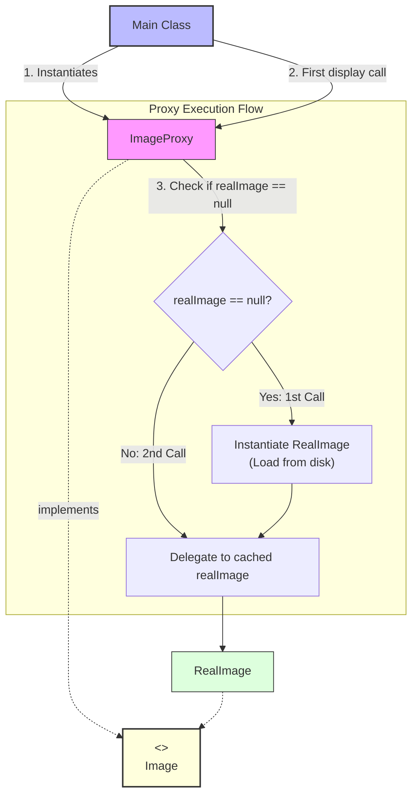

# Proxy Design Pattern

> **"Provide a surrogate or placeholder for another object to control access to it."** — *Gang of Four (GoF)*

---

## 📖 Introduction

The **Proxy Pattern** is a structural design pattern that provides an intermediary surrogate or placeholder object for another target object. The proxy controls access to the target object, enabling lazy initialization, caching, access control (security), logging, or remote procedure calls without modifying the target object's code.

In high-performance applications, initializing resource-heavy objects (such as high-resolution images, database connections, or remote network sockets) upfront can degrade application startup time and waste memory. A Virtual Proxy defers expensive object creation until the moment the object is actually requested, and subsequently caches the instance for subsequent calls.

---

## 🛑 Problem Statement vs. Solution

### ❌ Without Proxy Pattern (Eager Heavy Object Loading)
Instantiating heavy objects immediately on client startup wastes memory and causes latency, even if the object is never displayed:
```java
// Heavy image loaded from disk immediately during construction
Image image = new RealImage("Wallpaper.jpg"); // Expensive I/O execution upfront!
```

###  With Proxy Pattern (Lazy Initialization & Caching)
The lightweight proxy is created instantly. The expensive `RealImage` is only loaded from disk upon the first `display()` invocation, and subsequent calls reuse the cached instance:
```java
// Lightweight proxy created instantly without disk I/O
Image image = new ImageProxy("Wallpaper.jpg"); 

image.display(); // 1st call: Lazy-loads RealImage from disk and displays
image.display(); // 2nd call: Reuses cached RealImage (skips disk load)
```

---

## 🛠️ System Architecture & Mapping

| Component | Role | Description |
| :--- | :--- | :--- |
| **`Image`** | Subject Interface | Declares the common interface (`display()`) shared by `RealImage` and `ImageProxy`. |
| **`RealImage`** | Real Subject | Heavy object performing expensive operations (loading image file from disk). |
| **`ImageProxy`** | Proxy | Surrogate object controlling access to `RealImage` via lazy initialization and caching. |
| **`Main`** | Client | Interacts with the `Image` interface without knowing whether it is speaking to a proxy or real subject. |

---

## 🗺️ Architectural Workflow



---

## 🔍 Code Walkthrough

### 1. Subject Interface (`Image.java`)
Defines the standard contract for image operations:
```java
package StructuralDesignPatterns.ProxyPattern;

public interface Image {
    
    void display();
}
```

### 2. Real Subject (`RealImage.java`)
The heavy resource object that performs disk loading upon instantiation:
```java
package StructuralDesignPatterns.ProxyPattern;

public class RealImage implements Image {

    private String filename;

    public RealImage(String filename) {
        this.filename = filename;
        loadImage();
    }

    private void loadImage() {
        System.out.println("Loading image from disk: " + filename);
    }

    @Override
    public void display() {
        System.out.println("Displaying " + filename);
    }
}
```

### 3. Proxy Component (`ImageProxy.java`)
Manages `RealImage` lifecycle, deferring creation until requested:
```java
package StructuralDesignPatterns.ProxyPattern;

public class ImageProxy implements Image {

    private String filename;
    private RealImage realImage;

    public ImageProxy(String filename) {
        this.filename = filename;
    }

    @Override
    public void display() {

        if (realImage == null) {
            realImage = new RealImage(filename);
        }

        realImage.display();
    }
}
```

### 4. Client Usage (`Main.java`)
Demonstrates proxy creation, lazy initialization on first display, and cached execution on second display:
```java
package StructuralDesignPatterns.ProxyPattern;

public class Main {

    public static void main(String[] args) {

        Image image = new ImageProxy("Wallpaper.jpg");

        System.out.println("Proxy created.");
        System.out.println();

        System.out.println("First display:");
        image.display();

        System.out.println();

        System.out.println("Second display:");
        image.display();
    }
}
```

---

## 💡 Key Benefits

1. **Lazy Initialization (Virtual Proxy)**: Defers expensive object creation until the object is actually needed, optimizing application startup time and resource usage.
2. **Access Control & Caching**: Enables adding logging, security checks, or response caching transparently.
3. **Open/Closed Principle (OCP)**: You can introduce new proxy types (e.g., `ProtectionProxy`, `LoggingProxy`) without changing the client or real subject code.
